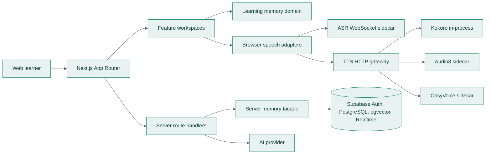

# Moss Engineering Guide

## Product Goal

Moss is a memory-guided English learning workspace. Each learning surface must help the
learner retrieve, use, evaluate, and transfer language in a real scenario. Avoid turning
the product into a static course catalog or a generic chatbot.

## Stack

- Next.js App Router, React, and TypeScript.
- Tailwind CSS v4 with semantic theme tokens from `frontend/src/app/globals.css`.
- shadcn/ui with Base UI primitives and Lucide icons.
- Supabase Auth, PostgreSQL, RLS, RPC, and Realtime.
- Vitest and Testing Library for automated checks.

## Commands

```bash
pnpm dev
pnpm lint
pnpm typecheck
pnpm test
pnpm check
pnpm build
```

The local development server uses `http://localhost:5577`.

## Source Boundaries

- `frontend/src/app`: routes, layouts, metadata, and server route handlers.
- `frontend/src/components`: shared application and shadcn/ui components.
- `frontend/src/features`: feature-owned client workspaces.
- `frontend/src/lib`: domain logic, runtime adapters, data, and Supabase clients.
- `frontend/src/lib/server`: server-only infrastructure shared by route handlers.
- `tests`: behavior-focused unit and component tests.
- `supabase`: schema and incremental update SQL.
- `docs`: architecture, product design, API, UI, deployment, and test documentation.

Use Server Components by default. Add `"use client"` only when a module needs browser APIs,
state, effects, or event handlers.

## Architecture



## Learning Memory

`LearningMemoryProvider` is the shared state owner for dashboard, conversation, review,
shadowing, and notebook features.

- Every interaction writes locally first.
- Authenticated users synchronize snapshots through Supabase.
- Cloud conflicts merge by item identity, latest timestamps, maxima for cumulative counters,
  and union for transfer targets and practiced expressions.
- Model configuration stays only in `moss:model-config:v1`; never add it to learning memory,
  API payloads unrelated to inference, logs, or Supabase.
- Raw microphone audio is not persisted.

When changing `LearningMemoryState`, update parsing, merge behavior, default data, API or SQL
contracts where relevant, tests, and architecture documentation together.

`recordLearningActivity` is the only writer. A learning activity and its event type come from
the single `learningActivityTypes` vocabulary; add a new surface there, never a parallel
enumeration. Distinguish observed behavior from self-reported outcomes: a recall attempt records
that retrieval happened, while a review rating is the only signal allowed to change strength and
interval. Navigation and passive views must never record a learning event, and UI copy must not
imply otherwise.

Dependency direction is one-way:

1. `app` composes routes and layouts; it does not own domain rules.
2. `features` own user workflows and may depend on `components` and browser-safe `lib`.
3. `components/ui` contains reusable primitives and never imports a feature.
4. Domain modules in `lib` do not import React. Server-only code stays under `lib/server` or a
   clearly server-only facade such as `lib/memory/server.ts`.
5. Route handlers validate transport input, authenticate, apply resource limits, call domain
   facades, and normalize errors. They do not embed persistence or prompt-building logic.
6. The browser talks to ASR and TTS only through their documented public protocols. TTS engine
   sidecars are private to the gateway.
7. Local learning writes succeed before cloud synchronization. External AI, vector retrieval,
   Realtime, ASR, and TTS failures must have explicit degraded behavior.

The canonical system diagrams and data ownership matrix are in `docs/architecture.md`. When a
boundary, persisted key, API contract, port, or data owner changes, update that document and the
relevant focused document in the same change.

## Naming

- Frontend file names are lowercase kebab-case.
- Functions and local variables use camelCase.
- React components and TypeScript types use PascalCase.
- Version persisted browser keys, for example `moss:learning-memory:v1`.

## UI Rules

- Build the usable workspace as the first screen. Do not add marketing hero sections.
- Keep operational pages compact, calm, and easy to scan.
- Cards are for repeated entities such as scenes, not for wrapping every page section.
- A scene card is the primary click target. Locked cards are not interactive.
- Conversation content is the visual focus; supporting guidance stays collapsible.
- Text input and live voice input are mutually exclusive modes.
- Focus phrases include a task label, English expression, and Chinese usage meaning.
- Validation changes use explicit word-level highlighting. Never use Markdown bold markers
  as the correction mechanism.
- Memory details remain visible. Do not collapse source, strength, review schedule, history,
  or transfer targets behind accordions.
- Use Lucide icons and shadcn components already installed in the repository.
- Use semantic colors such as `bg-card`, `text-muted-foreground`, and `text-primary`.
- Use `gap-*` for spacing, `size-*` for square dimensions, and `cn()` for conditional classes.
- Keep card radii at `rounded-lg` or smaller in product workspaces.
- Do not use negative letter spacing or viewport-scaled font sizes.

## Responsive Contract

- Support widths down to 320px and explicitly verify 390px.
- No horizontal page overflow at 390px.
- Desktop sidebars become sheets or stacked regions on smaller screens.
- Fixed controls, counters, waveforms, and progress elements must not shift when content
  changes.
- Text wraps inside its container; only compact identifiers and list titles may truncate.

## Scene Content

- `frontend/src/lib/demo-data.ts` owns scene identity, category, level, status, tags, and searchable
  vocabulary.
- `frontend/src/lib/conversation-scenes.ts` owns role-play goals, openings, focus phrases, recall
  hints, and optional rich expression notes.
- Rich idiom notes must include meaning, compositional reasoning, a cautiously worded origin,
  usage context, and a complete example. Mark disputed etymologies as uncertain.
- `frontend/src/lib/shadowing-dialogues.ts` owns dedicated presets and generated fallback scripts.
  Every dialogue includes both roles and identifies whether it is preset, generated, or
  memory-derived.
- Adding a scene requires scene, conversation, search, and shadowing tests. Update documented scene
  totals when they are intentionally stated.

## Conversation Contract

- `?scene=` selects an available scene; unknown and locked scene IDs use the default scene.
- The transcript is the primary scroll container.
- Voice mode owns the microphone and sends final recognition results automatically.
- Starting voice mode hides and disables the text composer.
- Ending voice mode releases all media tracks and restores text input.
- Unsupported or denied voice access keeps the learner in text mode.
- Only the most relevant memory summaries are sent to the conversation endpoint.

## Testing

For every behavior change:

1. Add or update a focused Vitest assertion.
2. Run `pnpm check`.
3. Run `pnpm build` for route, type, or bundling changes.
4. For visual changes, inspect desktop and 390px mobile screenshots and check page overflow.

Do not weaken tests to make a change pass. Keep existing user changes in a dirty worktree and
do not revert unrelated files.

## Documentation

- Keep `README.md` as the quick-start and document index, not a duplicate design specification.
- Record system boundaries and dependency rules in `docs/architecture.md`.
- Record HTTP, WebSocket, and RPC wire contracts in `docs/api.md`.
- Record operational configuration and rollout procedures in `docs/deployment.md`.
- Record local frontend, API, database, ASR, and TTS workflows in `docs/development.md`.
- Keep `docs/testing-report.md` factual and dated; do not claim manual or production verification
  that was not performed in the current environment.
- Prefer Mermaid for architecture, state, sequence, and deployment diagrams. Use prose for
  invariants, ownership, tradeoffs, and failure behavior.
- Link to the authoritative document instead of copying large sections between files.

## Definition Of Done

- The requested workflow works end to end.
- Loading, empty, disabled, error, active, and completion states remain coherent.
- Keyboard focus, accessible names, and dialog or sheet titles are present.
- Desktop and mobile layouts have no incoherent overlap or clipping.
- Tests, type checking, linting, and production build pass.
- Relevant documentation and the matching `plans/planned.md`, `plans/in-progress.md`,
  `plans/blocked.md`, or `plans/archived.md` entry reflect the final behavior.
