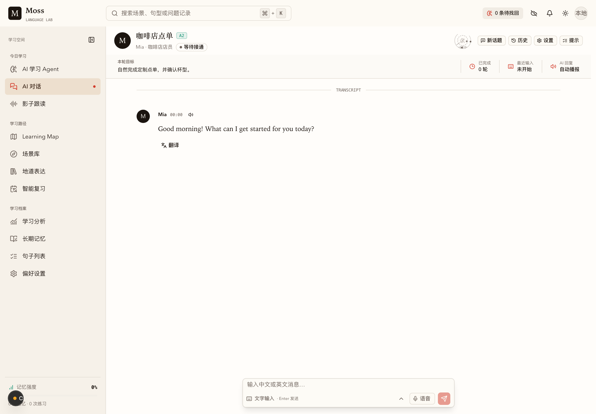
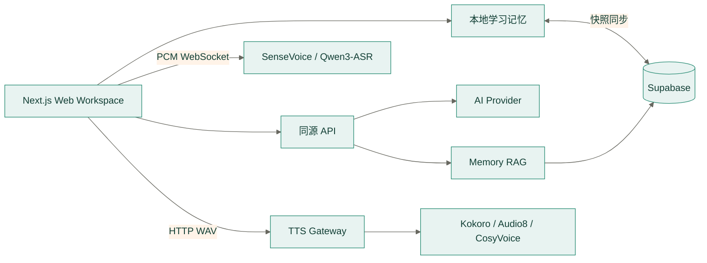

# Moss

**Memory-driven Optimized Smart Study · 记忆驱动的优化智能学习**

> Fight forgetting with science; make every study count.

Moss 是一个记忆驱动的英语学习工作区。它把场景对话、表达反馈、间隔复习、影子跟读和
跨场景迁移组织为同一条学习链路，而不是静态课程目录或通用聊天界面。



## 核心架构



关键边界：

- 学习操作先写入浏览器，登录后再通过 Supabase 同步。
- 多个模型配置与当前启用项只保存在 `moss:model-config:v1`，活动配置仅以加密信封进入同源推理接口。
- 对话只发送当前场景所需的短期记忆和少量长期记忆。
- 原始麦克风音频不持久化；TTS sidecar 不对浏览器直接开放。

完整说明见 [系统架构](docs/architecture.md)。

## 工作区结构

```text
frontend/          Next.js 应用、功能模块、共享组件和前端测试
backend/services/  ASR、TTS 网关与可选模型 sidecar
backend/supabase/  PostgreSQL、RLS、RPC 和 Realtime SQL
backend/tests/     Python 服务测试
docs/              架构、契约、设计、部署和测试文档
plans/             planned、in-progress、blocked、archived 工程任务
```

## 快速开始

要求 Node.js 22+、pnpm 11+ 和 Python 3.10+。

### 仅 Web 与演示数据

```bash
pnpm install
cp .env.example .env.local
# 将 NEXT_PUBLIC_DEMO_MODE 设为 true
pnpm dev
```

访问 `http://localhost:5577`。演示模式不会调用外部 AI provider，也不会写入向量数据库。

### 完整本地语音

```bash
pnpm tts:setup
pnpm asr:setup
pnpm dev:offline
```

`dev:offline` 启动：

| 服务 | 地址 | 说明 |
| --- | --- | --- |
| Web | `http://localhost:5577` | Next.js |
| TTS Gateway | `http://127.0.0.1:5578` | Kokoro 与 sidecar 统一入口 |
| ASR | `ws://127.0.0.1:5580/v1/asr/stream` | 默认 SenseVoice |

Audio8 和 CosyVoice 是可选的大模型运行时：

```bash
pnpm audio8:setup
pnpm cosyvoice:setup
pnpm tts:start
```

详细安装、硬件与协议说明见 [后端运行手册](backend/README.md)。

## 云端配置

1. 创建 Supabase 项目并配置 Email/OAuth。
2. 新实例执行 `backend/supabase/platform.sql`；已有实例执行
   `backend/supabase/update.sql`。
3. 在 `.env.local` 配置 Supabase 与 AI provider。
4. 运行 `pnpm check && pnpm build`。

生产环境不要启用 `NEXT_PUBLIC_DEMO_MODE`，不要把 service role key、数据库密码或 AI
密钥放入 `NEXT_PUBLIC_*`。

## 常用命令

| 命令 | 用途 |
| --- | --- |
| `pnpm dev` | 启动 Web 开发服务 |
| `pnpm dev:offline` | 启动 Web、ASR、TTS 与已安装 sidecar |
| `pnpm check` | lint、类型检查、前后端测试 |
| `pnpm test:coverage` | 前端覆盖率 |
| `pnpm build` | Next.js 生产构建 |
| `pnpm asr:test` | ASR 单元与协议测试 |
| `pnpm tts:test` | TTS 网关与 sidecar 单元测试 |
| `pnpm db:test` | 校验全量与增量 SQL 契约 |
| `pnpm expressions:generate` | 使用服务端模型配置重新生成内置表达数据 |

## 配置分组

`.env.example` 是变量名称和本地默认值的唯一清单。

| 分组 | 变量前缀 | 运行位置 |
| --- | --- | --- |
| 浏览器公开配置 | `NEXT_PUBLIC_*` | 浏览器与 Next.js |
| AI provider | `AI_*` | Next.js 服务端 |
| 模型配置信封 | `MODEL_CONFIG_*` | Next.js 服务端 |
| ASR | `MOSS_ASR_*`, `MOSS_SENSEVOICE_*` | Python ASR |
| TTS gateway | `MOSS_TTS_*`, `MOSS_KOKORO_*` | Python TTS |
| TTS sidecar | `MOSS_AUDIO8_*`, `MOSS_COSYVOICE_*` | 独立 Python 运行时 |

## 文档

| 文档 | 负责内容 |
| --- | --- |
| [系统架构](docs/architecture.md) | 系统边界、依赖方向、数据所有权和降级 |
| [详细设计](docs/detailed-design.md) | 产品信息架构与核心工作流 |
| [学习记忆与 RAG](docs/memory-rag-design.md) | 记忆模型、同步、向量检索和 Prompt |
| [双语对话设计](docs/bilingual-conversation-design.md) | 输入识别、反馈决策与语音交互 |
| [API 契约](docs/api.md) | HTTP、WebSocket 与 Supabase RPC |
| [界面规范](docs/ui-guidelines.md) | 视觉、组件、响应式和可访问性 |
| [开发手册](docs/development.md) | 本地运行、前后端开发、测试与故障排查 |
| [部署指南](docs/deployment.md) | 环境、拓扑、发布和回滚 |
| [测试报告](docs/testing-report.md) | 自动化范围、最近结果与剩余风险 |
| [工程协作规范](AGENTS.md) | 代码边界、命名、测试和完成标准 |

任务状态记录在 `plans/planned.md`、`plans/in-progress.md`、`plans/blocked.md` 和
`plans/archived.md`。
