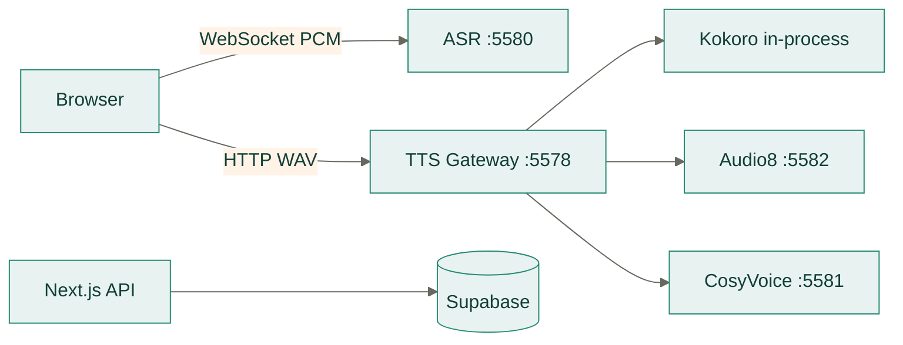

# Moss Backend

后端由独立语音服务和 Supabase 数据定义组成。Next.js 的业务 API 仍位于
`frontend/src/app/api`，避免把同一 Web 应用拆成两个重复的 HTTP 层。
完整的前后端本地开发流程见 [`docs/development.md`](../docs/development.md)，生产拓扑、
发布顺序和回滚见 [`docs/deployment.md`](../docs/deployment.md)。

## 服务拓扑



| 路径 | 职责 | 文档 |
| --- | --- | --- |
| `services/asr` | SenseVoice/Qwen3-ASR、VAD、WebSocket 协议 | [ASR](services/asr/README.md) |
| `services/tts` | TTS 网关、缓存、引擎适配和运行时 | [TTS](services/tts/README.md) |
| `supabase` | 全量/增量 SQL、RLS、RPC、pgvector、Realtime | [部署](../docs/deployment.md) |
| `tests/asr` | ASR 配置、协议和服务边界测试 | `pnpm asr:test` |
| `tests/tts` | TTS 网关与 sidecar 测试 | `pnpm tts:test` |

## 本地运行

```bash
pnpm tts:setup
pnpm asr:setup
pnpm dev:offline
```

`dev:offline` 以同一父进程启动 Web、ASR 和 TTS；任一必需子进程退出时会终止其余进程，
避免留下端口占用。Audio8 和 CosyVoice 未安装时不会阻止 Kokoro 工作。

`supabase/platform.sql` 用于新实例完整建库，`supabase/update.sql` 只保留当前增量变更；
`pnpm db:test` 校验两份 SQL 的安全契约。

配置 `.env.local` 后可运行 `pnpm db:test:remote`，以 publishable key 对远端表和 RPC
执行只读匿名权限检查。该检查不会写入数据，也不能替代在隔离项目执行 SQL 和认证用户 RLS
验收。配置两个专用测试账户后，`pnpm db:test:rls` 会写入并清理带随机标识的临时数据，
验证会话、消息和长期记忆的双账户隔离。

旧学习记忆快照的向量回填使用 `pnpm memory:backfill -- --dry-run` 预检，再运行
`pnpm memory:backfill`。该离线管理员命令需要 service-role key 和服务端 embedding 配置，
支持逐项检查点、幂等跳过和失败重试；详细步骤见 `docs/deployment.md`。

## 边界规则

- 服务默认绑定 loopback；公网暴露必须由 TLS/WSS 反向代理保护。
- 浏览器只访问 TTS gateway，不直接访问 Audio8 或 CosyVoice。
- ASR 不保存音频；TTS 不保存合成文本或用户学习状态。
- 模型目录、虚拟环境和生成音频不纳入版本控制。
- `.env.example` 是端口和环境变量名称的统一清单。
- Python 服务测试不得加载完整模型，真实质量和延迟使用目标硬件单独验收。
