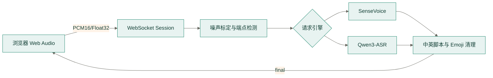

# Moss ASR Server

> 协议版本：当前实现
> 默认地址：`ws://127.0.0.1:5580/v1/asr/stream`

独立的中英文语音识别服务，可在 `Qwen/Qwen3-ASR-1.7B` 与
`iic/SenseVoiceSmall` 之间切换。浏览器持续发送单声道 PCM，服务端通过语音活动和
静音端点检测切分语句，再交给当前引擎自动判断语言并转写。
WebSocket 在整次通话中保持连接，可连续识别多轮发言。



## 安装与启动

需要 Python 3.10 或更高版本：

```bash
pnpm asr:setup
pnpm asr:start
curl http://127.0.0.1:5580/health
```

安装器会创建 `backend/services/asr/.venv`，默认下载 SenseVoiceSmall。需要启用
Qwen3-ASR 时运行 `pnpm asr:setup:qwen`，也可用 `pnpm asr:setup:all` 一次安装两者。
服务启动时只加载 `MOSS_ASR_ENGINE` 指定的默认引擎，另一个引擎在首次选择时懒加载，
避免启动时同时占用两套模型的内存。如需消除首次使用的冷加载等待，可用
`MOSS_ASR_PRELOAD_ENGINES` 在启动后台预加载额外引擎（`pnpm dev:offline` 默认预加载
`qwen3-asr`）；预加载在后台进行，不阻塞服务就绪，失败也只降级为懒加载。
Qwen3-ASR 自动优先选择 CUDA、Apple MPS 和 CPU；SenseVoice 使用 CUDA 或 CPU。

## 识别质量建议

- 中英混说、场景词汇和专有名词优先使用 Qwen3-ASR。先运行
  `pnpm asr:setup:qwen`，再在对话设置中选择 Qwen3-ASR。场景目标词会通过
  `context` 自动发送给模型。
- CPU 设备或延迟优先时使用 SenseVoice。它已启用 `language="auto"` 和
  `use_itn=True`，但不会使用场景词汇 `context`，中英频繁切换时通常不如
  Qwen3-ASR 稳定。
- 弱音或句首被截断时，可将 `MOSS_ASR_SPEECH_THRESHOLD` 降到 `0.008`，
  `MOSS_ASR_NOISE_THRESHOLD_MULTIPLIER` 降到 `1.8`，并将
  `MOSS_ASR_PRE_ROLL_SECONDS` 提高到 `0.4`。嘈杂环境下误触发增多时应反向调整。
- 停顿导致一句话被切成多段时，可将 `MOSS_ASR_ENDPOINT_SILENCE_SECONDS`
  提高到 `1.0` 或 `1.2`；该值也会等量增加句尾等待时间。修改环境变量后需要重启
  ASR 服务。

## WebSocket 协议

连接 `ws://127.0.0.1:5580/v1/asr/stream` 后，服务先返回：

```json
{
  "type": "ready",
  "sampleRate": 16000,
  "format": "int16",
  "engine": "sensevoice",
  "model": "SenseVoiceSmall",
  "requiresAuth": false
}
```

客户端发送启动配置后持续发送 PCM：

```json
{
  "type": "start",
  "sampleRate": 16000,
  "format": "int16",
  "engine": "sensevoice",
  "languages": ["zh", "en"],
  "context": "Vocabulary: latte, decaf, oat milk.",
  "token": "optional-deployment-token"
}
```

`engine` 支持 `qwen3-asr` 和 `sensevoice`。`languages` 只接受 `zh` 和 `en`，默认同时
启用；模型识别为其他语言或结果包含其他语言脚本时不会返回转写文本。`context` 可选，
最多 1000 字符；Qwen3-ASR 用它提供当前学习场景的目标词汇，SenseVoice 忽略该字段。
两者均不持久化音频。

音频格式支持 little-endian `int16` 和 `float32`。建议使用 16 kHz 单声道 PCM16，
每个二进制消息包含约 `40-100 ms` 音频。检测到约 850 ms 句尾静音后返回：

```json
{
  "type": "final",
  "text": "Could I get 一杯咖啡？",
  "segment": 0,
  "tokens": [],
  "timestamps": [],
  "language": "zh"
}
```

两个引擎均按完整语音段推理，因此当前不发送文本 `partial`；客户端自身的语音活动检测会
即时显示正在识别状态。`flush` 提交当前段并保持连接，`stop` 提交后关闭连接，
`ping` 返回 `pong`。

## 配置

| 环境变量 | 默认值 | 说明 |
| --- | --- | --- |
| `MOSS_ASR_HOST` | `127.0.0.1` | 监听地址 |
| `MOSS_ASR_PORT` | `5580` | 服务端口 |
| `MOSS_ASR_ENGINE` | `sensevoice` | 服务启动时预加载的默认引擎 |
| `MOSS_ASR_PRELOAD_ENGINES` | 空 | 启动时额外后台预加载的引擎（逗号分隔），使其首次使用免去冷加载 |
| `MOSS_ASR_MODEL_ID` | `Qwen/Qwen3-ASR-1.7B` | 下载来源 |
| `MOSS_ASR_MODEL_DIR` | `backend/services/asr/models/Qwen3-ASR-1.7B` | 本地模型目录 |
| `MOSS_SENSEVOICE_MODEL_ID` | `iic/SenseVoiceSmall` | SenseVoice 下载来源 |
| `MOSS_SENSEVOICE_MODEL_DIR` | `backend/services/asr/models/SenseVoiceSmall` | SenseVoice 本地模型目录 |
| `MOSS_ASR_MODEL_SOURCE` | `modelscope` | `modelscope` 或 `huggingface` |
| `MOSS_ASR_DEVICE` | `auto` | `auto`、`cuda:0`、`mps` 或 `cpu` |
| `MOSS_ASR_DTYPE` | `auto` | 自动使用 CUDA BF16，其他设备使用 FP32 |
| `MOSS_ASR_SAMPLE_RATE` | `16000` | 服务端目标采样率 |
| `MOSS_ASR_MAX_CHUNK_BYTES` | `65536` | 单个 WebSocket 二进制消息上限 |
| `MOSS_ASR_MAX_NEW_TOKENS` | `256` | 单段最大输出 token |
| `MOSS_ASR_SPEECH_THRESHOLD` | `0.018` | 服务端语音能量门限 |
| `MOSS_ASR_NOISE_CALIBRATION_SECONDS` | `0.5` | 通话开始时的环境噪声标定时长 |
| `MOSS_ASR_NOISE_THRESHOLD_MULTIPLIER` | `3.0` | 自适应噪声底与语音门限的倍率 |
| `MOSS_ASR_MIN_SPEECH_SECONDS` | `0.35` | 最短有效语音 |
| `MOSS_ASR_ENDPOINT_SILENCE_SECONDS` | `0.85` | 句尾静音时长 |
| `MOSS_ASR_PRE_ROLL_SECONDS` | `0.25` | 语音起点前保留的音频 |
| `MOSS_ASR_MAX_CONNECTIONS` | `2` | 单进程最大连接数 |
| `MOSS_ASR_MAX_AUDIO_SECONDS` | `60` | 单个语音段最大秒数 |
| `MOSS_ASR_ALLOWED_ORIGINS` | 本地 Moss 地址 | 逗号分隔 Origin 白名单 |
| `MOSS_ASR_API_KEY` | 空 | 设置后要求 `start.token` |

## Docker

```bash
docker build -t moss-qwen3-asr:latest backend/services/asr
docker run --rm --gpus all \
  -p 5580:5580 \
  -e MOSS_ASR_ALLOWED_ORIGINS=https://moss.example.com \
  -e MOSS_ASR_API_KEY=replace-me \
  moss-qwen3-asr:latest
```

已有模型卷时使用 `--build-arg DOWNLOAD_MODELS=0`，并挂载
`/app/backend/services/asr/models/Qwen3-ASR-1.7B`。生产环境应通过反向代理提供 WSS。

## 测试

```bash
pnpm asr:test
```

单元测试不加载模型。真实准确率与延迟应使用目标设备、麦克风和中英混合基准音频验收。

## 运维检查

- `GET /health` 只用于进程和模型状态检查，不代表真实识别质量。
- 生产日志不得记录 PCM 内容、完整转写或 API Key。
- `MOSS_ASR_MAX_CONNECTIONS` 是单进程设备保护，不是租户级配额。
- 扩容时每个连接保持粘性；同一次通话不能在多个实例间迁移内存缓冲。
- 修改 VAD 参数后，应同时验证弱音召回、噪声误触发和句尾延迟。
