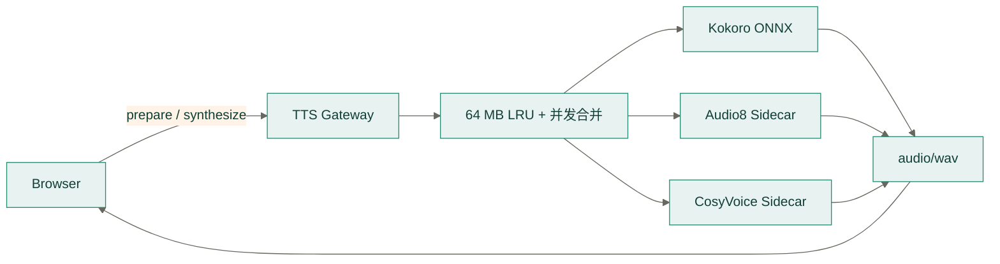

# Moss TTS Services

> 协议版本：当前实现
> 浏览器入口：`http://127.0.0.1:5578`

`backend/services/tts` 包含完整的本地语音合成子系统：

```text
tts/
├── engines/             网关使用的 Kokoro、Audio8、CosyVoice 适配器
├── models/              Kokoro 模型与 voice pack
├── runtimes/
│   ├── audio8/          Audio8 独立运行时，端口 5582
│   └── cosyvoice/       CosyVoice 独立运行时，端口 5581
├── app.py               对浏览器提供统一 HTTP API
├── start-gateway.mjs    只启动 5578 网关
└── start.mjs            启动网关及已安装的可选运行时
```



## 安装与启动

```bash
pnpm tts:setup
pnpm audio8:setup
pnpm cosyvoice:setup
pnpm tts:start
```

`tts:setup` 安装 Kokoro 英文 v1.0 与中文 v1.1-zh 模型。中文模型使用独立的
`voices-v1.1-zh.bin` 和 Misaki 中文 G2P，选择 `zf_*` 或 `zm_*` 音色时按需加载。
Audio8 和 CosyVoice 具有独立 Python 环境及较大模型，
需要时分别安装。`tts:start` 会启动网关，并自动检测和启动已安装的可选运行时。

只启动公开网关：

```bash
pnpm tts:gateway
```

## 网关协议

前端只访问 loopback 地址上的 `5578` 网关，不直接访问模型运行时。

- `GET /health`：返回网关和引擎状态。
- `POST /v1/tts/prepare`：准备指定引擎。
- `POST /v1/tts/synthesize`：返回 `audio/wav`。

```json
{
  "engine": "kokoro",
  "text": "Could I get a coffee, please?",
  "voice": "af_bella",
  "speed": 1,
  "seed": 2024
}
```

Audio8 和 CosyVoice 的模型、虚拟环境及官方运行时均位于各自的 `runtimes/` 子目录，
并被 Git 忽略。服务不可用时，前端回退到浏览器原生语音。

## 配置

| 变量 | 默认值 | 说明 |
| --- | --- | --- |
| `MOSS_TTS_HOST` | `127.0.0.1` | 仅允许 loopback |
| `MOSS_TTS_PORT` | `5578` | 网关端口 |
| `MOSS_TTS_ALLOWED_ORIGINS` | Moss 本地地址 | 额外允许的精确 Origin |
| `MOSS_AUDIO8_URL` | `http://127.0.0.1:5582` | 私有 Audio8 地址 |
| `MOSS_COSYVOICE_URL` | `http://127.0.0.1:5581` | 私有 CosyVoice 地址 |
| `MOSS_KOKORO_MODEL_PATH` | 本地英文模型 | Kokoro v1.0 ONNX |
| `MOSS_KOKORO_ZH_MODEL_PATH` | 本地中文模型 | Kokoro v1.1-zh ONNX |

完整默认路径见根目录 `.env.example`。

## 失败语义

- 网关无法连接：前端可回退浏览器系统语音。
- 网关已连接但请求无效或模型缺失：返回明确错误，不静默切换引擎。
- 可选 sidecar 未安装：`/health` 标记该引擎不可用，其他引擎继续服务。
- 相同参数并发请求：首个请求合成，其余请求共享结果。
- 新播放取消旧播放时，前端负责终止请求并释放 Blob URL。

## 测试

```bash
pnpm tts:test
```

单元测试不下载或加载完整模型。真实验收应记录目标设备、模型版本、冷启动、热态首包、
音频时长和主观音质。
