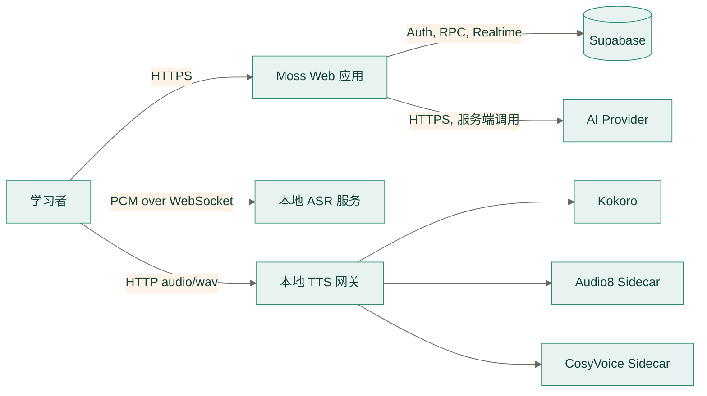
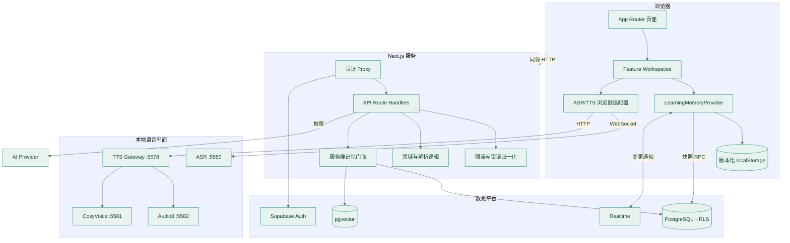
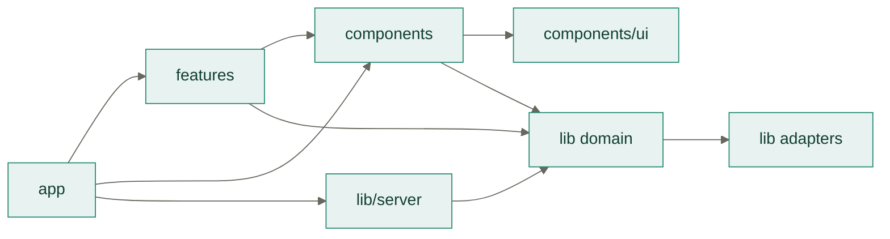
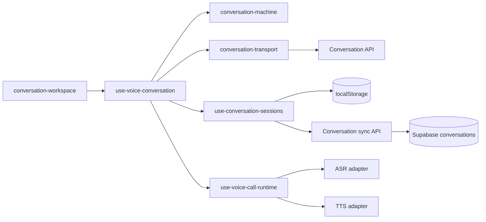
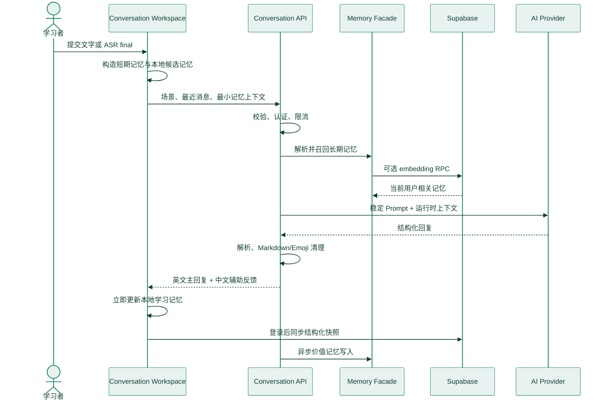
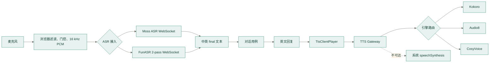
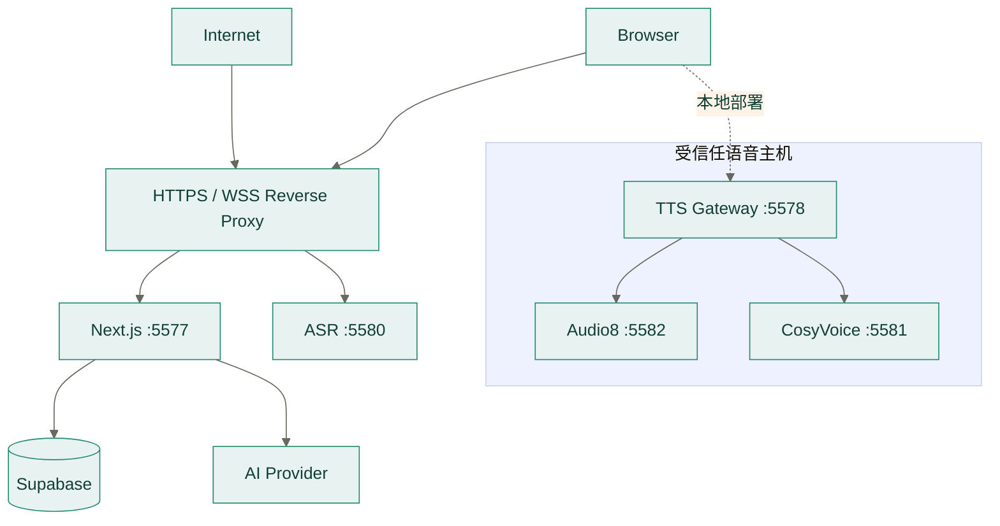

# Moss 系统架构

> 状态：当前实现基线
> 适用范围：Web 应用、学习记忆、Supabase、AI、ASR 与 TTS

## 1. 架构目标

Moss 是本地优先、记忆驱动的英语学习工作区。架构优先保证：

- 学习交互先在本机完成，云端故障不丢失当前操作。
- 每次模型请求只使用当前任务需要的最少上下文。
- 用户数据、模型配置和原始音频具有清晰且互不混淆的所有权。
- Web、AI、数据库、ASR 和 TTS 可独立部署、观测和降级。
- 领域规则保持纯函数化，UI 与外部服务只负责交互和适配。

## 2. 系统上下文

浏览器只直接访问 Next.js、Supabase 公共接口以及明确配置的本机语音服务。AI 密钥不会
进入学习记忆；TTS sidecar 不对浏览器暴露；原始麦克风音频不持久化。

## 3. 容器与职责

| 容器 | 负责 | 不负责 |
| --- | --- | --- |
| App Router | 路由、布局、metadata、HTTP 边界 | 学习算法、持久化细节 |
| Feature Workspaces | 页面工作流与交互状态 | 跨功能基础设施 |
| Learning Memory | 记忆领域模型、合并、调度、本地优先写入 | 模型配置、原始音频 |
| API Route Handlers | 校验、认证、限流、错误映射、用例编排 | UI 状态、直接拼 SQL |
| Memory Server Facade | RAG 召回、Prompt 组装、长期记忆写入 | HTTP 响应 |
| Supabase | 身份、RLS 数据、向量检索、跨设备事件 | 浏览器模型密钥 |
| ASR | PCM 分段和中英识别 | 对话推理、音频保存 |
| TTS Gateway | 统一合成协议、缓存、引擎路由 | 学习状态 |

## 4. 代码依赖方向

约束：

1. `components/ui` 不导入业务 feature。
2. `lib` 的领域算法不依赖 React、DOM 或路由。
3. 浏览器模块不得导入 `node:*` 或服务端密钥。
4. Route Handler 通过门面调用记忆能力，不直接访问 embedding 或向量表。
5. 跨路由基础设施放在 `frontend/src/lib/server/`，并保持无 React 依赖。
6. Python sidecar 通过协议隔离，前端不依赖具体模型 SDK。

### 4.1 对话前端边界

- `conversation-workspace` 只渲染状态并转发用户操作。
- `use-voice-conversation` 是稳定 facade，编排一次对话回合，不拥有传输或持久化细节。
- `conversation-machine` 定义纯状态和事件转换，可在没有 React/DOM 的环境中测试。
- `conversation-transport` 构造最小请求、处理模型配置信封轮换并归一化失败。
- `use-conversation-sessions` 负责本地优先的保存、恢复、完成、切换和删除；登录后按稳定客户端
  ID 幂等同步，云端失败不阻塞当前对话。浏览器保留全部有效本地会话；云端读取按固定页大小
  分批进行，并由同步层自动读取到末页。
- `use-voice-call-runtime` 独占麦克风、ASR、TTS、静默提醒和媒体资源释放。

## 5. 核心数据流

### 5.1 对话与记忆

RAG 或向量写入失败不会推翻已成功生成的对话。客户端提交的记忆与数据库召回内容都视为
不可信数据，只能用于创造找回机会，不能覆盖系统规则。

### 5.2 语音

语音模式拥有麦克风；文字与语音输入互斥。用户再次开口会取消旧推理和播报。结束通话、
权限拒绝或组件卸载时必须释放所有媒体轨道。

## 6. 数据所有权

| 数据 | 主副本 | 同步/传输 | 保留规则 |
| --- | --- | --- | --- |
| 内置场景与表达内容 | `demo-data.ts`、`conversation-scenes.ts`、`idiomatic-expressions.ts`、`expression-library.generated.json`、`shadowing-dialogues.ts` | 随 Web 构建发布，不写入用户快照 | 场景 ID 稳定；1000 条表达按 10 类场景归档；词源有争议时明确标注 |
| 用户导入表达 | `moss:expression-library:v1:<userId>` | 本机先写，通过 `/api/expressions` 分批同步 `expression_library_items` | RLS 用户隔离；同一用户、场景和规范化表达幂等更新 |
| 学习记忆快照 | `moss:learning-memory:v1:<userId>` | Supabase 快照与 Realtime | 本地优先，按身份隔离 |
| 学习进度与问题分析 | 学习记忆中的 `sceneProgress`、`items` 和 `events` | 随学习记忆快照同步 | 事件按 ID 合并并完整保留；地图、场景库和分析页只派生真实记录，空数据展示空状态 |
| 学习提醒与句子列表 | 学习记忆中的 `items` | 不单独同步，按 `nextReviewAt`、类型和来源派生 | 展示完整本地记录；不创建通知或句子副本 |
| 匿名学习记忆 | `moss:learning-memory:v1` | 不同步 | 登录迁移后删除匿名键 |
| 对话历史 | `moss:conversation-history:v1` | 当前不上传 | 本地会话恢复 |
| 对话交互偏好 | `moss:conversation-prefs:v1` | 不同步；仅导师模式枚举随推理请求发送 | 导师模式、布局、快捷键、续接与合并/判句时限 |
| 模型配置集合与当前启用项 | `moss:model-config:v1` | 仅当前启用配置以加密信封进入同源推理 API | 禁止写入数据库和日志 |
| ASR/TTS 偏好 | 版本化 localStorage key | 不同步 | 设备级偏好 |
| 跟读评分 | 学习记忆事件 | Supabase 快照与 `shadowing_attempts` | 保存声学分数，不保存录音 |
| 长期向量记忆 | Supabase `learning_memory_documents` | 对话、复习、跟读经服务端写入；旧快照由管理员 CLI 幂等回填；RPC 召回 | RLS 用户隔离 |
| 账户删除审计 | Supabase `account_deletion_audits` | 仅 server-only 管理员客户端写入 | 只保留 HMAC 用户指纹和聚合计数，不保留邮箱或学习内容 |
| API 限流计数 | Supabase `rate_limit_buckets` | 认证 API 通过 `check_rate_limit` 原子更新 | 不直接暴露或导出，账户删除时级联清理并检查残留 |
| 原始麦克风音频 | 内存与临时 Object URL | ASR WebSocket 或当前页面回放 | 不持久化 |

## 7. 安全与资源边界

- `/workspace/**` 在非演示模式下由 `proxy.ts` 刷新并验证 Supabase session。
- 用户表和向量表启用 RLS；RPC 使用 `auth.uid()`，调用者不能指定其他用户。
- 账户导出使用当前用户 session 与 RLS；账户删除的 Admin API 仅在邮箱二次确认后调用，
  删除后必须逐表验证残留。service-role key 和审计 HMAC 密钥只存在服务端。
- 浏览器可保存多个模型配置，但仅当前启用项使用 RSA-OAEP + AES-256-GCM 信封传输；
  服务端只在当前请求内解密。
- 推理 URL 只允许公网 HTTPS，开发环境额外允许 loopback；生产环境的浏览器自带模型主机
  受显式白名单约束，且 Provider 请求不跟随重定向。
- 认证 API 通过 Supabase `check_rate_limit` 按 `auth.uid()` 和固定 bucket 执行跨实例原子
  限流；额度与窗口由数据库决定，底层表不授予应用用户权限。RPC 不可用时，公共服务端
  模型请求拒绝继续；演示模式与携带加密 BYOK 配置的推理请求使用容量有界的进程内限流。
- Provider 原始错误只用于服务端诊断，不返回客户端。
- ASR/TTS 默认绑定 loopback，并限制 Origin、连接数、消息大小或文本长度。

## 8. 可用性与降级

| 依赖故障 | 产品行为 |
| --- | --- |
| Supabase 未配置 | 显式 demo 模式本地运行；正常模式拒绝受保护功能 |
| 快照同步失败 | 保留本地写入，展示离线或同步错误状态 |
| embedding/RPC 失败 | 使用客户端候选记忆继续对话 |
| AI provider 失败 | 返回稳定错误码，不保存失败回合为长期记忆 |
| ASR 不可用或授权拒绝 | 保持文字模式 |
| TTS 网关不可达 | 回退浏览器 `speechSynthesis` |
| 可选 TTS sidecar 缺失 | 其他已安装引擎继续工作 |

## 9. 部署拓扑

生产环境不应直接公开 TTS sidecar。ASR 若跨主机暴露，必须使用 WSS、精确 Origin 白名单和
API Key。完整配置与发布顺序见 [部署指南](deployment.md)。

## 10. 架构验证

- 单元与组件测试：`pnpm test`
- 静态检查：`pnpm lint && pnpm typecheck`
- 全量门禁：`pnpm check`
- 生产构建：`pnpm build`
- 数据库：运行 `pnpm db:test`，并在隔离 Supabase 项目分别执行 `platform.sql` 和
  `update.sql`，验证 RLS、RPC 和 Realtime
- 视觉：桌面与 `390px` 截图，并检查 `scrollWidth`
- 真实语音：在目标设备验证模型加载、首包延迟、打断和资源释放

专题设计：

- [详细产品与交互设计](detailed-design.md)
- [学习记忆与 RAG](memory-rag-design.md)
- [双语对话与反馈](bilingual-conversation-design.md)
- [API 契约](api.md)
- [部署指南](deployment.md)
