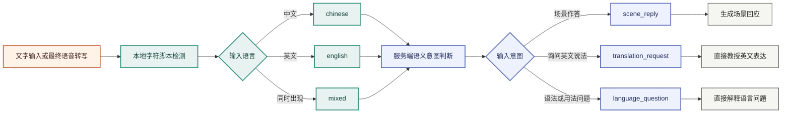
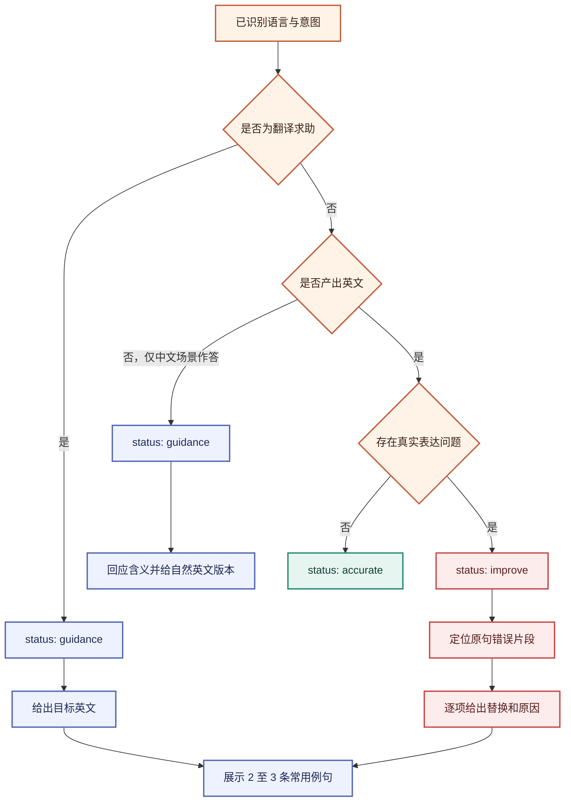
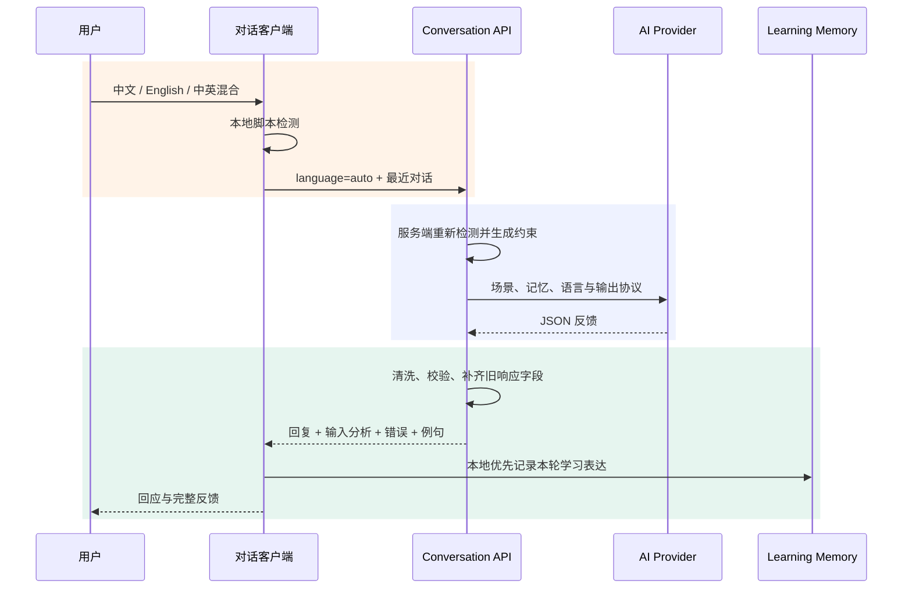
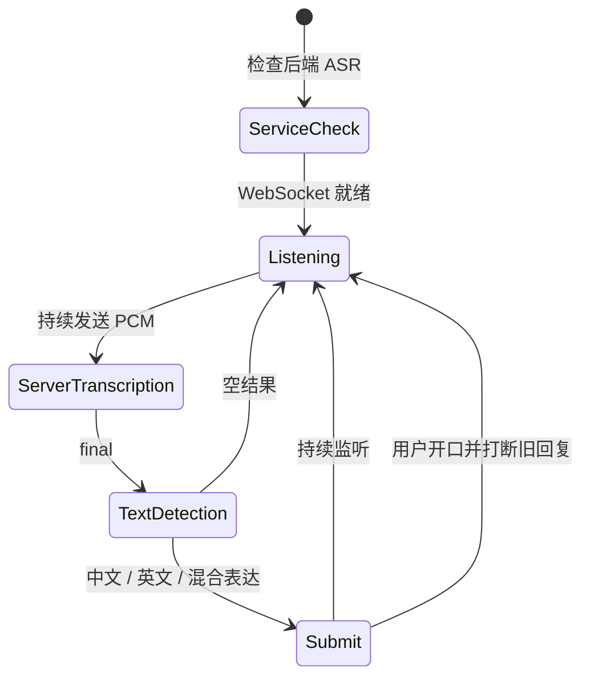
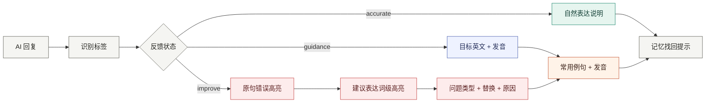

# 中英双语对话与反馈设计

> 状态：当前领域契约
> 本文负责语言、意图和反馈决策；HTTP 字段与错误码以 [API 文档](api.md) 为准。

## 目标

对话入口接受中文、英文和中英混合输入。系统先理解用户是在参与场景、询问英文说法，还是
讨论语言本身，再决定是否纠错。中文待翻译内容不能被记录为英语错误。

典型输入：

```text
could you teach me how to say 我想打球
我想打球怎么说
I am agree with you.
我想要一杯拿铁。
```

## 识别链路



本地检测只判断字符脚本，结果稳定、快速且无需下载模型。意图判断由服务端模型结合完整句意
完成；“怎么说”“teach me how to say”等明确模式由本地规则兜底。当前只支持中英文，
因此不引入对短句准确率有限的通用语言识别依赖。扩展到更多语言时，可在服务端替换为
fastText `lid.176` 或 CLD3，接口仍保持 `language` 枚举不变。

## 反馈决策



`improve` 只用于用户实际产出的英文错误。`guidance` 表示用户需要英文表达参考，不计为
错误或遗忘。每个问题的 `original` 必须是用户原句中的精确片段，以便客户端可靠高亮。

## 数据协议

```ts
type ConversationInputAnalysis = {
  language: "chinese" | "english" | "mixed" | "unknown"
  intent: "scene_reply" | "translation_request" | "language_question"
}

type ExpressionIssue = {
  kind: "grammar" | "word_choice" | "word_order" | "missing_word" | "register" | "clarity"
  original: string
  corrected: string
  explanation: string
}

type PracticeExample = {
  english: string
  chinese: string
}
```

完整响应示例：

```json
{
  "data": {
    "content": "You can say: \"I want to play basketball.\"",
    "translation": "可以说：“I want to play basketball.”",
    "recall": "先记住核心句，再替换时间、人物或地点造句。",
    "inputAnalysis": {
      "language": "mixed",
      "intent": "translation_request"
    },
    "validation": {
      "status": "guidance",
      "corrected": "I want to play basketball.",
      "explanation": "中文片段是待翻译内容，不作为英语错误。",
      "issues": [],
      "examples": [
        {
          "english": "I want to play basketball after work.",
          "chinese": "我想下班后去打篮球。"
        }
      ]
    }
  }
}
```

## 请求与降级



Provider 返回纯文本或旧版 JSON 时，服务端使用本地规则补齐 `inputAnalysis`、
`validation.issues` 和 `validation.examples`。上游失败仍返回统一错误，不把失败响应写入
学习记忆。

## 语音语言适配

Moss 不依赖浏览器或云端语音识别模型。浏览器通过 Web Audio API 对单声道音频执行高通
滤波、动态压缩和 16 kHz 重采样，再将 PCM16 持续发送给 `backend/services/asr`，或发送给
本机标准 FunASR 2-pass WebSocket 服务。自有服务可在 SenseVoiceSmall 与
Qwen3-ASR-1.7B 之间切换；FunASR 接入使用 online 结果更新临时转写，以 offline/final
结果提交完整句子。三种接入均只接受中文、英文及混合表达。
端点检测只结束当前语音段，WebSocket 在整次通话期间保持连接，因此学习者可以连续多次
发言。前端在短暂的自然停顿窗口内累积相邻 final；用户继续说话时延后提交，结束连续表达后
才合并为一个用户回合请求 AI。AI 思考和播报期间仍保持监听，持续检测到用户开口后立即停止
播报并取消旧请求，新问题进入独立回合；迟到的旧响应不会写入转写。



原始音频不保存。若浏览器不支持所需媒体能力、后端服务未就绪或权限被拒绝，界面回退
到文字输入，语言与意图识别能力不受影响。

## 界面呈现



反馈始终跟随对应 AI 回复，不阻塞用户消息进入转写。原句、错误原因和例句全部直接展示，
不放入折叠区。

## 领域不变量

- AI 主回复 `content` 必须是清理 Markdown 与 emoji 后的英文纯文本。
- 中文翻译、解释和建议只能进入辅助字段，不能混入主回复。
- `improve` 必须对应用户实际输入的英文问题；中文待翻译文本不能计为错误。
- `issues[].original` 必须能在原始输入中精确定位，客户端才可执行词级高亮。
- 被取消或迟到的响应不得写入转写、学习记忆或长期向量记忆。
- ASR 只提交最终中英文本；原始 PCM、非中英结果和空转写不得进入对话历史。
