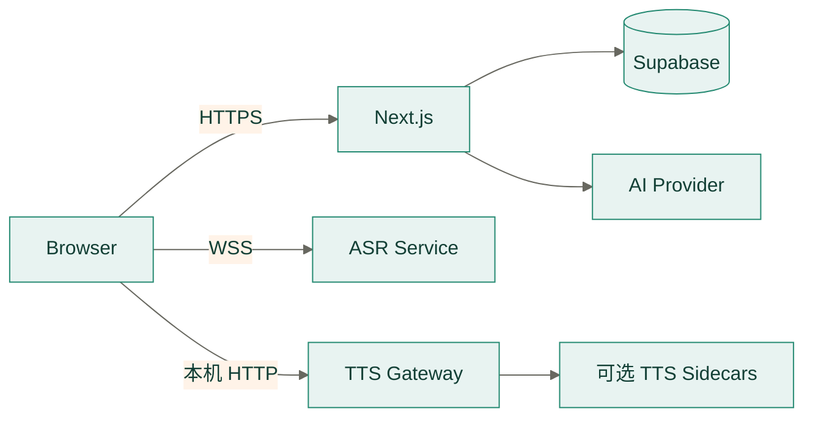

# 部署指南

> 状态：运行手册

## 部署拓扑



Web 与数据平台可以独立部署。TTS 设计为本机服务；ASR 可本机运行，也可通过受保护的 WSS
部署。sidecar 只处于 TTS 网关后的受信任网络。

### 组件部署矩阵

| 组件 | 必需 | 推荐位置 | 公网入口 | 持久状态 |
| --- | --- | --- | --- | --- |
| Next.js Web/API | 是 | Vercel 或 Node 22 容器 | HTTPS | 无；实例间共享限流在 PostgreSQL |
| Supabase | 云模式必需 | 托管 Supabase | Supabase HTTPS/WSS | Auth、PostgreSQL、Realtime、pgvector |
| AI Provider | 非演示模式必需 | 外部服务 | 仅 Next.js 出站访问 | Provider 自有 |
| ASR | 语音识别需要 | 用户本机或 GPU 节点 | 本机 WS 或受保护 WSS | 模型文件；不保存音频 |
| TTS Gateway | 本地高质量语音需要 | 用户本机 | 仅 loopback HTTP | 模型缓存；不保存学习数据 |
| Audio8/CosyVoice | 可选 | TTS 网关同机或私网 | 禁止直接公开 | 模型文件 |

部署边界必须保持不变：

- 浏览器的业务请求只进入同源 Next.js API。
- ASR **服务端**支持公网部署，必须使用 WSS、Origin 白名单和令牌认证；但前端
  `use-streaming-asr.ts` 的 `validateLocalWebSocketUrl` 只接受回环主机，浏览器当前无法
  直连公网 ASR。两者不冲突，但不能据此认为公网 ASR 已经可用。
- 浏览器只访问 TTS Gateway；Audio8 与 CosyVoice 不提供公网入口。
- 多实例 Next.js 不使用进程内状态完成用户级一致性或共享限流。

### 推荐发布顺序


1. 备份数据库并审核 SQL、环境变量和密钥变更。
2. 先部署向后兼容的数据库结构，完成静态、匿名和双账户 RLS 验证。
3. 独立发布并验证 ASR/TTS；旧 Web 版本此时仍应可工作。
4. 发布 Next.js Web/API，执行登录、文字对话、云同步、ASR 和 TTS 冒烟。
5. 观察错误率与延迟后再清理废弃字段或旧运行时。

## 本地开发

```bash
pnpm install
cp .env.example .env.local
pnpm dev
```

开发服务器默认运行在 `http://localhost:5577`。
如需使用匿名演示数据，在本地 `.env.local` 中设置
`NEXT_PUBLIC_DEMO_MODE=true`。该模式不会调用外部 AI provider。

邮箱注册会将验证链接回调到当前站点的 `/auth/callback`。只有在 Supabase Authentication
中启用 Google Provider 并设置 `NEXT_PUBLIC_SUPABASE_GOOGLE_ENABLED=true` 后，登录页才显示
Google 入口；同时需将本地及生产 `/auth/callback` 地址加入 Supabase Redirect URLs。

生产多实例部署必须配置稳定的 `MODEL_CONFIG_PRIVATE_KEY_BASE64`，用于解密浏览器模型配置
信封。本地开发未配置时会在进程内生成临时密钥。可生成一行 PKCS#8 DER Base64：

```bash
openssl genpkey -algorithm RSA -pkeyopt rsa_keygen_bits:2048 |
  openssl pkcs8 -topk8 -nocrypt -outform DER |
  base64 | tr -d '\n'
```

## 本地 TTS 服务

首次安装轻量 Kokoro 运行时、英文 v1.0 INT8 模型和中文 v1.1-zh INT8 模型：

```bash
pnpm tts:setup
```

Kokoro 模型、voice pack 与中文词表保存在 `backend/services/tts/models` 并被 Git 忽略。
英文与中文模型按音色懒加载，安装完成后运行不需要网络。日常开发使用：

```bash
pnpm dev:offline
```

该命令同时启动 `127.0.0.1:5578` 的 Python TTS 服务、已安装的可选 Audio8/CosyVoice
sidecar 和 `localhost:5577` 的前端。浏览器不直接依赖任何 TTS SDK。
`NEXT_PUBLIC_TTS_SERVICE_URL` 仅接受 `localhost`、
`127.0.0.1` 或 `::1`，禁止配置远程 TTS 地址。

本机服务连接失败时，产品界面自动切换到浏览器原生 `speechSynthesis`，不下载或运行
前端 TTS 模型。服务能够连接但返回模型缺失、参数错误等响应时不会静默降级，以便及时发现
安装或配置问题。

## 不启动本机语音服务

语音接入方式在“偏好设置 → 语音服务接入”中按 ASR 与 TTS 分别选择，配置保存在浏览器
`moss:speech-config:v1`。因此本机服务不是运行前提：

| 接入方式 | 是否需要本机服务 | 说明 |
| --- | --- | --- |
| 本机服务 | 是 | 默认值，连接 `5578`/`5580`；连接失败时当次会话自动回退到浏览器语音 |
| HTTP API | 否 | 对接任意 OpenAI 兼容的 `/audio/transcriptions` 与 `/audio/speech` |
| 浏览器引擎 | 否 | 直接使用 `SpeechRecognition` 与 `speechSynthesis` |

对接远程语音接口时，只需在设置里填写根地址、模型与密钥，或用环境变量提供默认值：

```bash
# 只提供公开地址与模型名；密钥由浏览器本地配置提供，不进入构建产物
NEXT_PUBLIC_ASR_API_URL=https://api.openai.com/v1
NEXT_PUBLIC_ASR_API_MODEL=whisper-1
NEXT_PUBLIC_TTS_API_URL=https://api.openai.com/v1
NEXT_PUBLIC_TTS_API_MODEL=tts-1
```

生产环境必须把允许的语音主机名写入白名单，否则 `/api/speech/*` 会拒绝转发：

```bash
AI_ALLOWED_BROWSER_SPEECH_HOSTS=speech.example.com
```

`api.openai.com` 与 `api.anthropic.com` 默认在白名单内。该白名单与模型服务使用的
`AI_ALLOWED_BROWSER_MODEL_HOSTS` 相互独立，两者都要配置才能同时支持远程推理与远程语音。
浏览器语音引擎依赖操作系统与浏览器支持（Chrome、Edge、macOS Safari 可用，识别质量由浏览器
实现决定）；不具备该能力的浏览器保持文字模式，并在对话中明确提示。

CosyVoice 为独立可选层，不与 Kokoro 环境共享依赖。首次对比前运行：

```bash
pnpm cosyvoice:setup
pnpm tts:start
```

安装器会固定官方 CosyVoice 源码版本并下载数 GB 的 `CosyVoice-300M-SFT`。sidecar
监听 `127.0.0.1:5581`，仅由 `5578` 网关访问。安装完成后可在对话页音色菜单中分别试听
CosyVoice 英文女声/男声和 Kokoro 音色。

Audio8 为独立可选层，使用 `Audio8/Audio8-TTS-Preview-0.6b`：

```bash
pnpm audio8:setup
pnpm tts:start
```

Audio8 sidecar 监听 `127.0.0.1:5582`，自动选择 CUDA、Apple MPS 或 CPU。模型面向高质量
中英文及多语言合成；低延迟优先时仍可在页面音色选择器中使用 Kokoro。

## 实时 ASR 服务

`backend/services/asr` 提供可切换的 Qwen3-ASR-1.7B 与 SenseVoiceSmall
中英双语识别服务。首次安装：

```bash
pnpm asr:setup
pnpm asr:start
curl http://127.0.0.1:5580/health
```

`asr:setup` 默认安装体积较小的 SenseVoiceSmall；运行 `pnpm asr:setup:qwen` 可追加
Qwen3-ASR，或使用 `pnpm asr:setup:all` 安装两者。

服务通过 `/v1/asr/stream` 接收单声道 PCM WebSocket 流。服务端语音活动检测在自然静音
处分段，所选引擎对完整语音段自动判断语言并返回 `final`。页面会把选择保存到
`moss:asr-config:v1`；服务端启动时仅预加载 `MOSS_ASR_ENGINE`，另一引擎首次使用时懒加载。
连接不会在每段后关闭，因此支持学习者连续多次发言；AI 思考或播报时麦克风仍保持监听。

如需复用已部署的标准 FunASR WebSocket 服务，在根目录 `.env.local` 配置：

```bash
NEXT_PUBLIC_FUNASR_SERVICE_URL=ws://127.0.0.1:10095
```

启动 FunASR 服务后，在对话设置的“语音识别”中选择 `FunASR`。该模式直接使用 FunASR
2-pass 协议，不经过 `backend/services/asr` 的 `/health` 或 `/v1/asr/stream`；地址必须为
loopback WebSocket。浏览器页面使用 HTTPS 时，本机服务需提供受信任的 WSS。连接失败时，
客户端自动回退到 `5580` 的 SenseVoice，并同步更新浏览器中的引擎选择。

容器构建及完整配置见 [`backend/services/asr/README.md`](../backend/services/asr/README.md)。ASR 服务端公网部署必须：

1. 由反向代理终止 TLS 并提供 WSS。
2. 设置精确的 `MOSS_ASR_ALLOWED_ORIGINS`。
3. 设置 `MOSS_ASR_API_KEY`，客户端在 `start` 控制消息中认证。
4. 使用 `/health` 作为 readiness 和 health check。
5. 按 WebSocket 连接横向扩容，避免单容器 CPU 过载。

以上是服务端能力的完整要求。浏览器能否使用这些端点，取决于前端的回环地址限制：
当前 `validateLocalWebSocketUrl` 会拒绝任何非回环主机，因此这些服务端加固项属于
预置能力而非可用链路。开放远程 ASR 前需要先修改该校验，并为非回环分支补上令牌
注入、Origin 校验与失败降级测试。

## Supabase

1. 创建 Supabase 项目。
2. 新项目在 SQL Editor 执行完整的 `backend/supabase/platform.sql`。
3. 已有项目先备份并核对基础业务表，再执行当前增量
   `backend/supabase/update.sql`；不要在已有实例重放 `platform.sql`。
4. 在 Authentication 中启用 Email，以及需要的 OAuth provider。
5. 将站点 URL 和 `/auth/callback` 添加到 Redirect URLs。
6. 把 Project URL 与 anon key 写入 `.env.local`。
7. 服务端账户删除配置 `SUPABASE_SERVICE_ROLE_KEY` 和至少 32 字节随机值
   `ACCOUNT_DELETION_AUDIT_SECRET`，两者禁止使用 `NEXT_PUBLIC_*` 前缀。

当前 `update.sql` 补充对话与消息的客户端幂等键、场景键、父会话所有权策略，并将业务表
和序列权限收敛到 authenticated 角色，同时创建 `expression_library_items`、
`rate_limit_buckets` 与 `check_rate_limit`。必须先应用数据库更新，再部署依赖表达导入和
共享限流的新应用版本。执行后应先运行 `pnpm db:test:remote` 确认匿名访问被拒绝，再使用
两个登录账户验证会话及表达隔离、限流隔离，并用同一账户的两个浏览器验证恢复和同步。
长期记忆表、pgvector 索引、RLS、`sync_learning_memory` 和
`match_long_term_memories` 的完整定义保留在 `platform.sql`。

提交数据库变更前运行静态契约检查：

```bash
pnpm db:test
```

配置远端项目的公开 URL 和 publishable key 后，运行只读匿名权限检查：

```bash
pnpm db:test:remote
```

该检查要求所有业务表和记忆 RPC 对匿名角色返回 PostgreSQL `42501` 权限错误。它不会写入
数据；新建、升级和认证用户 RLS 仍需在隔离项目中验证。

准备两个仅用于验收且已确认邮箱的账户，并配置
`SUPABASE_TEST_USER_A_EMAIL`、`SUPABASE_TEST_USER_A_PASSWORD`、
`SUPABASE_TEST_USER_B_EMAIL` 和 `SUPABASE_TEST_USER_B_PASSWORD` 后运行：

```bash
pnpm db:test:rls
```

该脚本使用随机标识写入临时会话、消息、表达和向量记忆，验证所有者读写、跨用户读取、
修改与删除隔离、父会话所有权、向量 RPC 隔离，并通过同一用户并发调用和第二用户独立调用
验证共享限流的原子性与用户隔离；结束时清理临时业务数据。禁止使用真实用户账户。

`backend/supabase` 只保留 `platform.sql` 和 `update.sql`。每次结构变更必须同时更新完整
定义与当前增量，并在隔离项目分别验证新建和升级路径。

不要把 service role key、数据库密码或 AI 密钥写入 `NEXT_PUBLIC_*` 变量。

## AI 服务

对话接口支持 OpenAI 兼容协议：

```bash
AI_BASE_URL=https://api.example.com/v1
AI_API_KEY=...
AI_MODEL_NAME=...
AI_API_TYPE=chat-completions
AI_ALLOWED_BROWSER_MODEL_HOSTS=models.example.com
AI_EMBEDDING_MODEL=...
```

`AI_API_TYPE` 支持 `chat-completions` 和 `anthropic-messages`；不配置时会根据
`AI_BASE_URL` 自动推断 Anthropic 官方地址，其他地址默认使用 OpenAI 兼容协议。
浏览器自带模型在生产环境默认只允许 `api.openai.com` 和 `api.anthropic.com`；
其他 OpenAI 兼容服务必须把准确主机名加入 `AI_ALLOWED_BROWSER_MODEL_HOSTS`（逗号分隔）。
生产环境未把主机加入白名单时，BYOK 验证与推理请求直接得到
`400 invalid_model_config`（本地与 Preview 不受限，容易漏配到生产才暴露）。
生产环境拒绝私网、回环、链路本地地址，所有环境都拒绝 Provider 重定向；部署侧仍应限制
Next.js 服务的内网出口。
正常模式缺少配置时返回 `service_not_configured`。认证 API 使用 Supabase 固定窗口共享
限流，数据库 RPC 不可用时返回 `rate_limit_unavailable`；携带有效加密 BYOK 配置的
推理和翻译请求仍由应用实例执行容量有界的本地限流。网关必须继续执行请求日志脱敏和
模型调用预算。
`AI_EMBEDDING_MODEL` 可选；启用时必须兼容 OpenAI `/embeddings` 契约并输出 1536 维
向量。未配置或向量服务不可用时，对话回退到本地长期记忆。
`NEXT_PUBLIC_SUPABASE_ANON_KEY` 与 `AI_MODEL` 仅作为旧部署的兼容变量。

### 旧记忆 embedding 回填

先备份目标数据库，并确认 `learning_memory_snapshots` 与
`learning_memory_documents` 已部署。回填命令只允许在受控管理终端运行，需要
`SUPABASE_SERVICE_ROLE_KEY`、`AI_BASE_URL`、`AI_API_KEY` 和
`AI_EMBEDDING_MODEL`；service-role key 禁止暴露给浏览器或写入仓库。

先执行只读扫描：

```bash
pnpm memory:backfill -- --dry-run
```

确认候选数量后执行回填：

```bash
pnpm memory:backfill
```

脚本按用户 UUID 游标分页，不设置总记录上限；每个记忆项完成后原子更新
`MEMORY_BACKFILL_CHECKPOINT`。中断后再次运行会从检查点继续。文档使用与后续复习、跟读
相同的 `(user_id, source_type, source_id)` 键；已有实时文档不会被旧快照覆盖，已有回填
文档仅在内容指纹变化时更新。Provider、读取和写入失败按
`MEMORY_BACKFILL_RETRY_ATTEMPTS` 重试，耗尽后退出且不推进当前项。完整重扫使用
`pnpm memory:backfill -- --restart`。检查点只保存用户游标和记忆项 ID，不包含学习内容或
密钥。

### 长期记忆评估

发布前使用固定的去标识化数据集运行：

```bash
pnpm memory:evaluate -- \
  --dataset /secure/path/production-sanitized.json \
  --format json \
  --output .tmp-memory-evaluation.json
```

数据格式、标注规则、指标定义和 HNSW 实验约束见
[长期记忆评估](memory-evaluation.md)。不得使用仓库中的合成样例确定生产参数，也不得把
原始用户对话提交到仓库。

## Vercel

Vercel 只承载 Next.js Web 与业务 API。ASR、TTS 网关与 sidecar 都不能部署到 Vercel，
原因见[多服务部署边界](#多服务部署边界)。语音能力由用户本机或独立 GPU 节点提供。

### 项目设置

| 设置项 | 值 | 说明 |
| --- | --- | --- |
| Root Directory | `frontend` | 必填，理由见下 |
| Framework Preset | Next.js | 与 `frontend/vercel.json` 一致 |
| Install Command | `pnpm install --frozen-lockfile` | 由 `vercel.json` 提供 |
| Build Command | `pnpm build` | 由 `vercel.json` 提供 |
| Node.js | 22.x | 由 `frontend/package.json` 的 `engines` 提供 |

Root Directory 必须为 `frontend`，不能改为仓库根。对话系统 Prompt 现在是
`src/lib/memory/conversation-prompt-text.ts` 中的源码常量，不再在运行时读取 Markdown 文件，
因此部署不再依赖 `process.cwd()` 定位 Prompt 资源或 `outputFileTracingIncludes` 解析。
设置项仍必须保留：`vercel.json` 位于 `frontend/`，读不到它 Vercel 会回退到根目录的
Next.js 检测结果并采用错误的构建命令。

仓库只有 `frontend` 一个 workspace 包，`pnpm-lock.yaml` 与 `pnpm-workspace.yaml`
位于仓库根。Vercel 依赖其 pnpm monorepo 支持向上查找 lockfile 并安装整个 workspace，
因此 `installCommand` 才能解析到正确的锁文件。

`pnpm-workspace.yaml` 的 `allowBuilds` 已批准 `sharp`、`esbuild` 与 `protobufjs` 的构建
脚本，Vercel 构建无需额外批准。Kokoro、Audio8 与 CosyVoice 的推理运行时全部位于
Python 服务内，Node 侧不安装 `onnxruntime-node`。

### 环境变量分层

`next.config.ts` 在构建期对 `NEXT_PUBLIC_*` 求值并内联进产物，因此**必须配置在
Production、Preview 和 Development 三个环境**，只在运行时补充不会生效。

| 变量 | 注入时机 | 是否必需 |
| --- | --- | --- |
| `NEXT_PUBLIC_SUPABASE_URL`、`NEXT_PUBLIC_SUPABASE_PUBLISHABLE_KEY` | 构建期内联 | 必需 |
| `NEXT_PUBLIC_SUPABASE_GOOGLE_ENABLED` | 构建期内联 | 启用 Google 登录时必需 |
| `NEXT_PUBLIC_DEMO_MODE` | 构建期内联 | 部署环境必须为 `false` 或不设置 |
| `NEXT_PUBLIC_TTS_SERVICE_URL`、`NEXT_PUBLIC_ASR_SERVICE_URL`、`NEXT_PUBLIC_FUNASR_SERVICE_URL` | 构建期内联 | 保持默认 loopback 值 |
| `NEXT_PUBLIC_ASR_API_URL`、`NEXT_PUBLIC_ASR_API_MODEL`、`NEXT_PUBLIC_TTS_API_URL`、`NEXT_PUBLIC_TTS_API_MODEL` | 构建期内联 | 使用 HTTP API 语音接入时必需 |
| `NEXT_PUBLIC_SUPABASE_ANON_KEY`、`AI_MODEL` | 构建期内联 | 仅旧部署兼容 |
| `SUPABASE_SERVICE_ROLE_KEY`、`ACCOUNT_DELETION_AUDIT_SECRET` | 运行时服务端 | 账户删除与导出必需 |
| `AI_BASE_URL`、`AI_API_KEY`、`AI_MODEL_NAME` | 运行时服务端 | 非演示模式必需 |
| `AI_EMBEDDING_MODEL`、`AI_ALLOWED_BROWSER_MODEL_HOSTS` | 运行时服务端 | 可选 |
| `AI_ALLOWED_BROWSER_SPEECH_HOSTS` | 运行时服务端 | 生产环境使用远程语音接口时必需 |
| `MODEL_CONFIG_PRIVATE_KEY_BASE64` | 运行时服务端 | 生产多实例必需 |
| `MOSS_TTS_*`、`MOSS_ASR_*`、`MOSS_KOKORO_*` | 不适用 | Vercel 上不要配置 |

前三行未配置时，`next build` 仍会成功，但登录、云同步与对话会在运行时报
`service_not_configured`。构建通过不代表配置正确。

`MOSS_TTS_*` 与 `MOSS_ASR_*` 是 Python 服务的配置，在 Vercel 上设置无任何效果，
却容易被误当作 Web 层变量。语音地址变量不要改成远程地址：`tts-client.ts` 只接受
`http:` 且主机为回环地址，`use-streaming-asr.ts` 只接受 `ws:`/`wss:` 且主机为回环
地址，配置远程域名会在运行时抛错而非静默降级。

### 生产必需检查

1. 生成并配置 `MODEL_CONFIG_PRIVATE_KEY_BASE64`，否则每个实例会生成临时密钥对，
   多实例无法解密同一份浏览器模型配置信封。故障特征：`GET /api/conversation` 返回的
   `keyId` 随实例漂移，BYOK 请求间歇性得到 `409 model_config_key_expired`（客户端会
   自动重取公钥重试一次，但仍多一次往返）；Vercel 运行时日志会出现
   `MODEL_CONFIG_PRIVATE_KEY_BASE64 is not configured` 告警。
2. 确认 `NEXT_PUBLIC_DEMO_MODE` 未开启。演示模式会让 `proxy.ts` 跳过认证校验。
3. 将 Vercel 生产域名与 `/auth/callback` 加入 Supabase Site URL 与 Redirect URLs。
4. 部署前在本地运行 `pnpm check` 与 `pnpm test:coverage`。

### 语音服务在 Vercel 部署下的行为

Vercel 部署后，本机语音服务一定不可用：

- 文字对话、记忆、复习、跟读评分中的非录音部分正常。
- `local` 接入只有在用户本机运行 `pnpm asr:start`、`pnpm tts:gateway` 时可用，浏览器经
  HTTPS 页面访问 `http://127.0.0.1:5578` 依赖浏览器的 loopback 豁免。
- 连接失败时 TTS 回退到浏览器原生 `speechSynthesis`；ASR 若浏览器支持
  `SpeechRecognition`，当次会话自动回退到浏览器识别并提示一次，否则保持文字模式。
- 云端语音能力应使用 `api` 接入：配置 OpenAI 兼容端点并把主机名写入
  `AI_ALLOWED_BROWSER_SPEECH_HOSTS`，请求由本站 `/api/speech/*` 转发。

若采用集中式自托管 ASR（自建 WebSocket 服务），前端仍按回环限制拒绝远程 `ws:` 地址，
需要先扩展 `validateLocalWebSocketUrl` 的策略，并同时补齐令牌认证、Origin 白名单和租户配额。

### ASR 的 Vercel 构建入口

仓库根提供 ASR 的 ASGI 构建入口，使 `vercel build` 能解析出顶层 `app`：

| 文件 | 作用 |
| --- | --- |
| `asgi.py` | Vercel 入口，`app = create_app()`；ASR 服务本身仍只用工厂函数 |
| `requirements.txt` | `-r backend/services/asr/requirements.txt`，依赖只有一份真相 |
| `vercel.json` | 按 `functions.asgi.py.excludeFiles` 排除前端、文档、虚拟环境与测试 |

该项目的 Root Directory 必须是**仓库根**：入口以 `backend.services.asr` 包被导入，仓库根
才是包可见的位置，Vercel 不会递归查找嵌套目录的 `app.py`。WebSocket 需要启用 Fluid
compute（2025-04-23 之后创建的项目默认开启）。

构建可以通过，**运行不成立**，属于已知不可行而非待修复缺陷：

| 约束 | 本项目需要 | Vercel 上限 |
| --- | --- | --- |
| Qwen3-ASR CPU bfloat16 推理峰值内存 | ~4.5 GB（`engine.py` 实测注释） | Hobby 2 GB / Pro 4 GB |
| `torch` 安装体积 | ~570 MB | Python bundle 标准 500 MB，需 large functions 公测 |
| 加速器 | CUDA 或 MPS | 无 GPU，1–2 vCPU |
| 浏览器可达性 | `use-streaming-asr.ts` 的 `validateLocalWebSocketUrl` 只接受回环主机 | 即使部署成功也无法连接 |

SenseVoiceSmall 是唯一在算术上可能的引擎，但仍受无 GPU、冷启动重复加载与前端回环限制
约束。生产 ASR 仍按[多服务部署边界](#多服务部署边界)落在自托管 GPU 节点或用户本机；
可达性决策见 `plans/planned.md` 的 T-302。

### 多服务部署边界

| 组件 | 部署位置 | 依据 |
| --- | --- | --- |
| Next.js Web/API | Vercel | 无状态，实例间共享限流在 PostgreSQL |
| Supabase | 托管 Supabase | Auth、PostgreSQL、Realtime、pgvector |
| AI Provider | 外部服务 | 仅 Next.js 出站访问 |
| ASR | 自托管 GPU 节点或用户本机 | 需要模型常驻与长连接 |
| TTS 网关 | 用户本机 | 前端强制回环校验 |
| Audio8/CosyVoice sidecar | TTS 网关同机 | 禁止直接公开 |

更详细的组件矩阵、ASR 的 WSS 终止要求与自托管方式见[部署拓扑](#部署拓扑)与
[语音服务生产化](#语音服务生产化)。

### Next.js 自托管

标准 Node 运行方式：

```bash
pnpm install --frozen-lockfile
pnpm check
pnpm build
NODE_ENV=production pnpm start
```

运行用户只需要构建产物、生产依赖和运行时 Prompt 文件。`next.config.ts` 已通过
`outputFileTracingIncludes` 将对话系统 Prompt 纳入构建追踪。反向代理需要：

- 把 HTTPS 请求转发到 `127.0.0.1:5577`。
- 保留 `Host`、`X-Forwarded-Proto` 和客户端地址头。
- 为流式模型响应关闭代理缓冲或设置足够小的缓冲区。
- 请求体上限不得低于应用 API 契约，但也不能无限放大。
- 由平台提供多实例滚动发布、健康探测和旧版本快速切回。

Next.js 进程不应持有需要跨实例一致的业务状态。固定窗口限流依赖 Supabase RPC；数据库
不可用时，普通认证推理请求按明确错误失败，不退回各实例独立计数。

## 语音服务生产化

### ASR 节点

ASR 可以使用 `backend/services/asr/Dockerfile` 构建：

```bash
docker build -t moss-asr:release backend/services/asr
docker run --rm --gpus all \
  -p 127.0.0.1:5580:5580 \
  -e MOSS_ASR_HOST=0.0.0.0 \
  -e MOSS_ASR_ALLOWED_ORIGINS=https://moss.example.com \
  -e MOSS_ASR_API_KEY="$MOSS_ASR_API_KEY" \
  moss-asr:release
```

生产代理把外部 `wss://speech.example.com/v1/asr/stream` 转发到内部 5580，并启用 WebSocket
Upgrade、空闲超时和连接上限。负载均衡按连接保持粘性；一次通话的内存音频缓冲不能跨实例
迁移。扩容依据是并发连接、设备内存和实时系数，不按 HTTP 请求数估算。

Readiness 先检查 `/health`，再用短基准音频验证能够收到 `final`。只检查进程存活无法发现
模型缺失、设备回退或转写质量下降。

### TTS 网关与 sidecar

TTS 默认是浏览器所在设备的 loopback 服务。需要集中托管时，当前前端的安全策略不会接受
远程 `NEXT_PUBLIC_TTS_SERVICE_URL`；必须先设计认证、租户配额和传输安全，不能直接把
5578 暴露到公网。

本机或受控工作站使用进程管理器分别托管：

```bash
pnpm tts:gateway
pnpm audio8:start
pnpm cosyvoice:start
```

网关是必需进程，两个 sidecar 可独立重启。进程管理器应设置工作目录为仓库根目录、加载
根 `.env.local`、转发 `SIGTERM`，并限制失败重启频率。发布新模型时先启动 sidecar 并通过
网关 `/health` 和短句合成验收，再把该引擎开放给用户；回滚只需撤下异常 sidecar，Kokoro
仍可继续服务。

## 健康检查与冒烟

每次发布至少验证：

| 层级 | 检查 |
| --- | --- |
| Web | 首页与 `/workspace` 返回成功，静态资源无 404 |
| Auth | Email/OAuth 回调回到当前域名，不接受站外 `next` |
| Conversation | 一轮文字输入产生英文主回复和独立中文辅助 |
| Memory | 本地先写成功，认证用户刷新后可恢复，同账号双窗口可合并 |
| Database | 匿名访问业务表被拒绝，两个用户不能读取彼此数据 |
| ASR | `/health` 正常，WSS 可连接，短音频得到 `final` |
| TTS | 网关 `/health` 正常，至少一个音色返回可播放 WAV |
| Shadowing | 可播放预设、互换角色、录音评分，原始录音不持久化 |

冒烟账户必须是专用测试账户。不要用生产用户对话验证日志、导出或删除流程。

## 数据备份

- 开启 Supabase Point-in-Time Recovery 或每日数据库备份。
- 录音使用独立私有 Storage bucket，不和公开学习素材混放。
- 恢复演练至少每季度执行一次，并验证 Auth 用户、RLS 和 Storage 对象引用。

## 生产检查

- `NEXT_PUBLIC_SUPABASE_*` 指向生产项目。
- `NEXT_PUBLIC_DEMO_MODE` 未设置或为 `false`。
- RLS 已对所有用户数据表启用。
- `rate_limit_buckets` 与 `check_rate_limit` 已部署，并通过双账户及双实例并发验证。
- `expression_library_items` 已部署，导入表达按用户和场景隔离且包含在账户导出与删除中。
- `learning_memory_snapshots` 已加入 Realtime publication。
- pgvector、`learning_memory_documents` 和 HNSW 索引已创建。
- 使用两个不同用户验证 `match_long_term_memories` 不会跨用户返回数据。
- 验证账户导出覆盖全部用户表；在专用账户执行删除后确认审计状态为 `completed` 且
  `residual_counts` 全部为 0。
- AI 密钥只存在于服务端环境变量。
- OAuth 回调域名与当前生产域名一致。
- `pnpm check`、`pnpm test:coverage` 和 `pnpm build` 全部通过。

## 可观测性与告警

服务端日志使用请求 ID 串联入口、限流、Provider 和数据库错误，但必须去除 Authorization、
模型密钥、模型配置信封、完整对话和转写文本。建议至少采集：

| 组件 | 指标 |
| --- | --- |
| Next.js | 请求数、P50/P95/P99、`4xx/5xx`、`429`、Provider 超时 |
| Supabase | RPC 错误、连接数、慢查询、RLS 拒绝、Realtime 重连 |
| ASR | 活跃连接、拒绝连接、final 延迟、音频段时长、设备内存 |
| TTS | 冷/热首包延迟、缓存命中、合成失败、sidecar 可用性 |
| 浏览器 | 同步失败、语音降级、未处理异常、页面横向溢出回归 |

告警必须能区分依赖不可用和用户输入错误。ASR/TTS 的健康状态不能通过记录原始音频或完整
文本来换取可观测性。

## 发布与回滚

1. 在预发布环境运行 `pnpm check`、`pnpm build` 和数据库契约验证。
2. 先发布向后兼容的数据结构，再发布读取新结构的应用。
3. 对 Web、ASR、TTS 分别执行 health/readiness 检查；模型进程存活不等于语音质量通过。
4. 观察认证失败率、API `429/502`、快照同步错误、ASR final 延迟和 TTS 首包延迟。
5. 应用回滚只回退无破坏性的代码版本；数据库回滚必须使用预先审核的逆向脚本或备份恢复。

禁止直接用 `platform.sql` 覆盖已有生产实例。网关仍需承担匿名入口的跨实例配额和滥用
防护。

### 回滚决策

- 仅 UI 或 Next.js 逻辑回归：切回上一应用构建，不回滚兼容数据库变更。
- AI Provider 异常：保留应用版本，切换受支持 Provider 或进入明确降级，不泄露配置。
- ASR 异常：停止接收新连接并把流量切到健康节点；现有连接自然结束或由客户端重连。
- 可选 TTS sidecar 异常：从网关健康列表移除该引擎，保留 Kokoro 和浏览器系统语音。
- 数据库破坏性变更：停止写入，执行预审逆向脚本或备份恢复，再验证 RLS 与快照一致性。

回滚后仍要执行最小冒烟并记录触发条件、影响范围、数据修复和再次发布前置条件。
