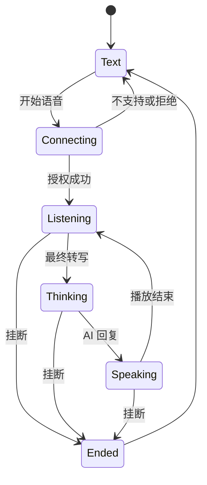
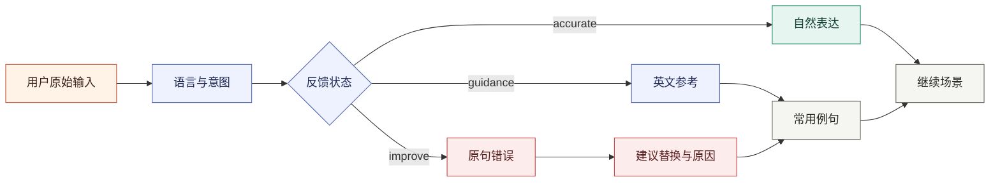

# Moss 详细设计

> 状态：当前产品与交互基线
> 技术边界见 [系统架构](architecture.md)，线协议见 [API 契约](api.md)。

## 1. 设计目标

Moss 的核心不是提供更多练习入口，而是让用户把学过的表达在正确时间重新找回，并迁移到
新的真实情景。界面围绕四个连续动作组织：

```text
选择场景 -> 完成对话 -> 形成记忆 -> 找回并迁移
```

本轮设计解决以下问题：

- 场景库由信息行改为可扫读、可整卡进入的场景卡片。
- AI 对话移除重复的页面标题，让转写内容直接成为首屏主体。
- 焦点短语同时说明表达本身、沟通目的和中文使用含义。
- 实时语音与文字输入保持互斥，避免重复发送和输入状态歧义。
- 智能复习在一个连续工作区内同时呈现题目、答案、评分和队列。
- 长期记忆完整展示学习证据、调度结果和迁移计划。
- Workspace 首页使用紧凑瀑布流同时呈现计划、记忆、场景、练习信号和迁移路径。

## 2. 信息架构

| 路由 | 主要任务 | 主信息 |
| --- | --- | --- |
| `/workspace` | 执行今日计划 | 记忆优先级、三步计划、成功标准 |
| `/workspace/scenes` | 选择练习情景 | 分类、等级、场景任务、进度 |
| `/workspace/conversation` | 连续完成情景交流 | 对话转写、输入模式、纠错、提示 |
| `/workspace/review` | 从情境中找回答案 | 线索、推荐表达、自评、队列 |
| `/workspace/notebook` | 检查长期学习证据 | 强度、历史、调度、迁移目标 |
| `/workspace/sentences` | 找到练习形成的句子 | 英文表达、类型、来源、强度、复习状态 |
| `/workspace/shadowing` | 用声音固定表达 | 原音、录音、评分、发音记忆 |

导航按“今日学习、学习路径、学习档案”分组。桌面端使用可折叠侧栏，移动端使用 Sheet，
页面本身不重复提供第二套导航。

## 3. 视觉系统

### 3.1 方向

视觉采用安静、清晰的学习工作台风格。暖白背景承载长时间阅读，深墨文字保持对比度，
珊瑚色只表示当前动作或重点，青绿色表示成功与稳定记忆。信息层级主要由分隔线、留白、
字体角色和局部底色建立，不使用装饰性悬浮面板堆叠。

### 3.2 排版

- UI 正文：Noto Sans SC。
- 英文表达与主要学习内容：Noto Serif SC。
- 时间、编号、等级和百分比：IBM Plex Mono。
- 页面标题为 24-30px；工作区标题为 16-20px；辅助元数据为 10-12px。
- 字间距固定为默认值，不根据视口缩放。

### 3.3 组件

- 场景等重复实体使用最大 8px 圆角卡片。
- 页面章节使用边线和背景带，不套入第二层卡片。
- 主操作使用实心 Button，次操作使用 outline 或 ghost。
- 状态、等级和标签使用 Badge。
- 进度统一使用 Progress，并提供可访问名称。
- 所有工具按钮使用 Lucide 图标和 `aria-label`。

## 4. 场景库

### 4.1 筛选

- 等级与场景分类都使用带 CheckboxItem 的多选菜单。
- 未选择任何选项表示全部；菜单显示已选数量并提供清除动作。
- 筛选工具栏在页面滚动时固定在工作区顶部，不重复绘制分隔边框。
- 筛选结果数量即时更新，不改变卡片排序。

### 4.2 卡片

卡片由四层信息构成：

1. 本地场景图片、中文标题、英文标题、语言等级 Badge。
2. 完整任务描述，不截断。
3. 三个任务标签和三个核心词汇。
4. 练习进度、累计时长和进入方向。

可用卡片整卡点击进入对话。锁定卡片不响应点击，并说明解锁条件。101 个场景按 10 个生活
领域组织，网格在手机、平板、桌面和宽屏分别使用 1、2、3、4 列。卡片采用紧凑间距，
图片由项目 `frontend/public/scenes` 本地提供，不依赖运行时外链。

“生活与职场地道表达”保留 100 组人工审校注释作为专项对话目标。完整内容从对话提示栏
移到独立的“地道表达”菜单，对话侧栏只保留入口，避免长词库挤占转写空间。

### 4.3 地道表达库

独立词库包含 1000 条高频词组、固定搭配、短语动词和实用句型：100 条审校内容加上按 10
类场景各 90 条补充内容。每条完整展示中文含义、词语组合或隐喻解释、审慎来源、英文例句、
语境和表达类型；存在争议的词源必须明确说明不确定性。

页面使用连续行列表，不用卡片嵌套。搜索、来源筛选和可多选场景筛选共同作用于完整数据集；
筛选区固定在全局顶栏下方。首批渲染 60 条，底部哨兵接近视口时继续加载下一批直至全部结果，
查询和导入不设置业务总量上限。

导入弹窗提供“粘贴 JSON”和“上传文件”两个数据入口，不提供逐条字段表单。JSON 文本粘贴后
自动校验，并使用按需加载的 Monaco Editor；文件入口接受 UTF-8 CSV/JSON 并提供 CSV
模板。两种入口都使用单行紧凑摘要展示有效、重复和错误数量。有效记录先写本机，再按 200
条一批同步当前用户的 `expression_library_items`；
数据库不可用时明确保留本机状态。用户导入项稳定排在内置项之前，并提供行级编辑和删除；
修改与删除同样先更新本机，再按稳定 `clientId` 同步云端。内置表达保持只读。

## 5. AI 对话

### 5.1 布局

页面不再保留外层 PageHeading。场景标题、语言等级、角色、会话状态和计时集中在固定会话
头部；中间转写区独立滚动；输入控制固定在底部。工作区铺满当前内容区域，不使用额外的
外框；对话正文限制在适合阅读的宽度。右侧提示默认收起，展开后可拖拽分隔线在
`280px` 至 `520px` 之间调整宽度，宽度保存在浏览器本地。

移动端保持相同的信息顺序，提示内容进入右侧 Sheet。390px 下控制项允许换行，但不能产生
横向滚动。

### 5.2 输入状态机



约束：

- `text` 状态显示文字输入框、发送按钮和语音模式入口。
- 进入任意 `voice.*` 状态后，文字输入框从界面移除。
- 语音识别在未静音时持续运行；AI 思考或播放语音期间检测到用户开口，会取消旧请求和播报。
- SenseVoice / Qwen3-ASR 最终转写自动提交；识别中的临时状态不进入历史消息。
- 语音控制区在通话期间持续显示 Agent 动画、状态标题和状态说明；`listening` 明确显示
  “可以说话”，避免仅依赖波形判断录音是否可用。
- Agent 动画使用 GSAP 驱动双向轨道、扫描线、核心脉冲和音量条；聆听、思考、回应使用
  不同节奏与语义颜色，静音时保留低强度待机效果。
- 结束通话后停止识别、取消播报、释放所有音轨并恢复文字输入。
- 连续静默提醒最多 3 次；超过上限仍未收到有效回应时自动结束通话并释放媒体资源。
- 浏览器不支持语音识别或麦克风授权失败时保持 `text`，不创建伪语音会话。
- hook 层再次拒绝语音模式下的文字草稿提交，避免 UI 之外的竞态。

### 5.3 焦点短语

每个焦点短语使用以下结构：

```ts
type FocusPhrase = readonly [
  label: string,
  phrase: string,
  meaning: string,
]
```

- `label`：本轮沟通动作，例如“礼貌请求”。
- `phrase`：可迁移的英文表达骨架。
- `meaning`：中文含义、语气或使用条件，不只做逐字翻译。
- 每轮结构化表达反馈生成新的动态焦点；动态焦点按最新回合优先累加在场景默认焦点之前，
  并按英文表达去重。恢复本地历史会话时使用已保存的反馈重建相同列表。

提示栏顺序固定为：本轮目标、可选的专项表达词库、表达焦点、长期记忆、场景切换。场景分类与等级都支持多选，
下拉内容通过 Portal 呈现，避免被对话工作区裁剪。

智能复习与影子跟读在桌面端使用一致的三栏工作区：左侧为可滚动队列，中间为当前任务，
右侧为学习证据或反馈。主任务和两侧栏分别滚动；移动端按队列、主任务、辅助信息顺序堆叠。
工作区侧栏底部使用平均记忆强度进度条，同时展示记忆数和练习次数。

顶部全局搜索使用 Dialog 呈现，索引页面入口、已解锁场景和当前本机学习记忆。桌面搜索栏、
移动端搜索按钮及 `Command/Ctrl + K` 共用同一弹窗；触发器使用等宽按键显示 `⌘ + K`，
弹窗使用
页面、场景和记忆横向标签筛选，结果区域独立滚动。方向键移动选中项，Enter 直接导航。
搜索完全在浏览器内完成，不上传查询内容，也不截断本地匹配结果。

顶部学习提醒使用 Popover 展示已经到期的真实记忆，空数据时明确说明当前没有待复习项。
句子列表完整展示学习记忆中的英文表达，并支持按表达、词汇、语法和发音筛选；列表行根据
到期状态进入复习，未到期记录进入来源场景或跟读工作区。具体记忆入口通过 `memory`
查询参数传递目标 ID，复习、跟读和迁移对话必须优先使用该记忆；未知 ID 回退默认队列。
提醒和句子列表都不维护独立副本。

### 5.4 对话反馈

- 对话路由使用完整可用内容宽度，转写、输入框和会话概览保持同一对齐线。
- 会话概览持续展示当前目标、已完成轮次、最近输入来源和 AI 语音状态。
- 完成首个用户回合后，本机自动保存完整转写；刷新时按本机偏好配置的时限恢复最近会话
  及其场景，默认 30 分钟，超时后才创建新会话。历史面板继续支持恢复、二次确认删除和
  显式新建。本地历史不按固定条数截断；登录后的云端历史分批读取并自动加载到末页。
- 文字回复等待期间输入框仍可发送；可配置的短等待窗口会合并连续问题，仅提交一次请求，
  服务端仍按顺序回答全部未回答问题。
- ASR final 会过滤空白、纯符号、语气词及非中英文结果，再按可配置停顿时长聚合为完整句子。
- 会话头部只保留新对话、历史、设置与场景提示入口；导师模式、TTS 音色和 ASR 引擎
  集中在设置按钮下方的浮窗中，避免压缩主内容宽度。
- 导师模式保存在设备级对话偏好中并作用于下一次文字或语音请求：自然交流只纠正影响
  沟通的问题，温和纠错提供高影响问题与练习例句，沉浸英语不自动返回中文辅助内容。
- 无论用户通过文字还是语音提交，AI 回复都自动使用当前音色播报。
- AI 语音开始前暂停 ASR 音频采集，播放结束后再恢复监听，防止系统播报形成回声输入。
- 用户表达提交后立即进入转写，不显示“正在验证表达”或其他阻塞式评分状态。
- AI 先回应用户表达的含义，再在同一条 AI 回复下显示简短表达反馈。
- 每轮识别中文、英文或中英混合输入，并区分场景作答、翻译求助和语言问题。
- 中文待翻译内容使用“表达参考”状态，不作为英语错误；英文错误才进入“发现表达问题”。
- 错误反馈同时展示用户原句、错误片段、建议替换、问题类型和具体原因。
- 需要巩固的表达直接展示 2 至 3 条中英对照常用例句，并提供逐句发音。
- 修改内容使用词级背景高亮，不使用 Markdown 加粗符号。
- AI 主回复只展示英文；中文翻译、记忆提示和学习建议统一放在同条消息下方的中文辅助区域。
- AI 英文回复中的列表或引用表达可渲染为结构化效果内容，但不展示 Markdown 语法标记。
- 播放按钮紧随英文回复标题行。
- 记忆提示说明表达来源及本轮复用目的。



完整协议和降级策略见
[`bilingual-conversation-design.md`](bilingual-conversation-design.md)。

## 6. 智能复习

### 6.1 工作区

桌面端使用一个有边界的三栏工作区，左侧为本组队列，中间为当前找回任务，右侧为记忆依据
和迁移场景。移动端按“队列 -> 当前任务 -> 学习证据”顺序堆叠。

中间包含：

- 当前来源场景、序号和组内进度。
- 情境线索。
- 显示答案动作。
- 推荐表达、发音按钮和解释。
- 成功次数、总接触次数、遗忘次数和当前间隔。
- 四档自评按钮。

左侧包含：

- 队列总数。
- 当前项、已完成项和未完成项。
- 每项的来源、强度和当前间隔。
- 调度变化说明。

右侧完整展示当前强度、累计找回率、成功与遗忘次数、当前间隔、来源说明和全部迁移目标。

评分后立即调用间隔重复算法，更新强度、重复次数、间隔和下次复习时间。带目标记忆进入时，
该项固定在本组首位；完成整组后携带同一记忆进入它的首选迁移场景，没有迁移目标时回到
来源场景。

## 7. 长期记忆

记忆列表按强度从低到高排序，优先暴露需要处理的内容。每条记忆完整展示：

- 类型、标签、来源场景和是否到期。
- 情境线索、推荐表达和用法解释。
- 当前强度。
- 成功找回次数、总接触次数、找回率和遗忘次数。
- 当前调度间隔、最近接触时间和下次复习时间。
- 最近一次本地事件类型及结果。
- 全部迁移目标及每个目标的迁移理由。

整条记忆是主要操作入口。到期项进入智能复习；未到期项进入优先迁移场景。详情不使用折叠
组件，确保用户可以直接检查 Agent 的判断依据。

### 7.1 学习分析

学习分析使用同一个受控周期筛选器驱动能力指标、每日活动和薄弱点：

- “最近 7 天”和“最近 30 天”按本地自然日计算，包含当天并在跨过午夜时自动刷新。
- “本阶段”使用 Learning Map 当前 CEFR 节点，只统计该等级可用场景的完整事件历史。
- 表达准确度和找回成功率只使用周期内对应事件；没有样本时显示“暂无数据”，不显示为 0%。
- 活跃记忆按周期内实际练习的记忆 ID 去重，薄弱点按周期内失败次数和当前记忆强度排序。
- 图表按连续自然日补齐无练习日期；没有事件时显示稳定的空状态。

## 8. 影子跟读

影子跟读为场景库中的每个可用场景提供多轮预设对话；重点场景使用专用脚本，其余场景根据
场景目标、角色和词汇生成基础脚本。从具体学习记忆进入时，在队列首位增加包含该表达的目标
对话。桌面端左侧为可滚动场景队列，中间为听对话、跟角色、去应用三阶段主任务，右侧显示
角色设置、反馈与发音焦点；移动端按队列、主任务、反馈顺序堆叠。

- 队列行是主要切换入口，显示序号、等级 Badge 和对话句数。
- 主任务标题标记 `场景预设`、`场景生成` 或 `记忆定制`，避免把生成脚本误认为人工预设。
- 对话中的任意一句都可设为跟读目标；切换台词时同步切换扮演角色，也可通过“互换角色”
  一次切换整段练习侧。
- 中文翻译由工具栏 Switch 控制且默认关闭，避免练习前直接暴露中文提示。
- 播放速度支持 `0.75×`、`1.0×`、`1.25×`。
- 选择新场景后停止当前播放与录音，并回到听对话阶段。
- 跟读阶段默认开启“自动接话”，按脚本顺序构成“对方提示 → 学习者跟读 → 对方接话”的循环：
  - 进入跟读阶段或目标句变化时，先播放紧邻目标句之前的对方台词作为提示；已经作为上一轮
    接话播过的台词不重复播放，手动切换目标句、互换角色或重新进入跟读阶段时重新提示。
  - 一次录音评分保存后自动播放脚本中紧随其后的对方台词，并把跟读目标推进到本角色的下一句；
    操作区、波形和录音对比同步切换到新目标句。对方没有接话或本角色没有下一句时停止推进，
    不回绕到已练过的台词。
  - 关闭“自动接话”后恢复手动选句，不播放提示，也不自动推进目标。
  - 对方正在播报时禁用录音，避免扬声器回声进入麦克风采集。
- 跟读阶段使用 MediaRecorder 录音；完成一次后，“重新录音”会立即开始下一次采集，不再
  经过额外确认。当前页面会保留同一句的历次录音、综合分、时长和相邻分差，并允许逐次回放；
  离开页面时统一释放临时音频 URL，原始音频不持久化。
- 中栏占满页面标题下方的剩余区域；桌面不设置额外最大高度，移动端使用视口约束。阶段内容
  独立滚动并预留滚动条槽位，播放、录音与进入下一阶段的操作区固定在中栏底部，不随长脚本
  或评分内容增加而移动。
- 上一场景、下一场景提供连续训练；应用阶段进入对应 AI 场景复用。
- 设置页的“系统发音”与 AI 对话共享 `moss:tts-config:v2`。影子跟读中的 AI 角色沿用
  当前音色，另一角色自动匹配同语种的不同音色，整段播放按说话人切换。

## 9. 数据、同步与 RAG

`LearningMemoryProvider` 维护唯一的学习记忆状态。写入顺序如下：

```text
用户操作
  -> 纯函数更新 LearningMemoryState
  -> localStorage 立即持久化
  -> 登录用户通过 RPC 写入 Supabase 快照
  -> Realtime 推送其他设备更新
  -> 冲突合并后重试
```

多个模型配置与当前启用项只保存在 `moss:model-config:v1`；只有当前启用配置可进入加密的
推理请求，所有配置都禁止进入学习记忆快照或数据库。已保存配置可从列表直接调用同源验证
接口，验证时仍只发送当轮加密信封，并在行内保留成功或失败状态。对话接口只接收当前场景
最相关的少量记忆摘要。原始麦克风音频不持久化。

短期记忆只保留当前场景目标、回合数和最近 3 条用户输入。长期记忆分为结构化快照与
Supabase pgvector 文档：快照用于离线合并和调度，向量文档用于场景约束的语义召回。
完整设计见 [`memory-rag-design.md`](memory-rag-design.md)。

设置页的“账户与数据”区域提供完整云端 JSON 导出和永久删除。删除操作使用独立 Dialog，
要求输入当前邮箱确认；服务端确认 Auth 用户已删除后，浏览器清理全部 `moss:` 前缀本地
数据并回到登录页。仅存本机的模型配置不会上传到导出接口。

## 9.1 法律文档

`/terms` 与 `/privacy` 是两份公开的静态文档，共享 `components/legal-document.tsx` 的排版
框架：`LegalDocument` 负责站点标识、返回登录入口、单一 `max-w-3xl` 阅读列与页脚互链，
`LegalSection` 负责章节骨架，`LegalCrossLink` 保证正文互链与页脚链接指向同一路由。

两份文档声明托管服务范围，并明确把自行部署的实例排除在责任范围外，因为项目以 Apache-2.0
开源。隐私政策的内容必须与代码一致：处理者清单对应 Supabase 与 AI 推理提供方，
`moss:model-config:v1` 与不落盘的原始麦克风音频按“不持久化”描述，用户自带模型端点时
内容直接发往该服务商。登录页页脚与登录表单的同意句都提供两个文档的真实链接，
避免出现指向不存在路由的同意声明。

未确定的主体信息以显式占位符保留（运营者、联系邮箱、适用法律与管辖地、生效日期、
保留期限、数据存储区域），集中在两份文档内，便于替换后重跑 `pnpm check`。

## 10. 响应式与可访问性

- 最小支持宽度为 320px，重点验收宽度为 390px。
- 页面、卡片、输入区和筛选器不得产生横向溢出。
- 动态文本允许换行；仅短标题和紧凑标识可截断。
- Sheet 必须包含 Title 与 Description。
- 图标按钮必须提供 `aria-label`，状态变化使用 `aria-live` 或语义状态。
- 进度条提供具体可访问名称。
- 动画遵循 `prefers-reduced-motion`。
- 键盘焦点必须可见，整卡链接保留明确的 focus ring。

## 11. 验收清单

- 场景页提供 101 个场景，等级和分类均可多选。
- 场景筛选栏吸顶，卡片使用本地图片和紧凑间距。
- 可用场景整卡可点击，锁定场景不可点击。
- 所有可用场景都有三条带中文含义的焦点短语。
- 对话页首屏主体是转写内容，右侧提示默认收起。
- 对话场景和等级筛选不会被容器裁剪或互相遮挡。
- 语音进行时页面不存在可提交的文字输入框。
- 不支持语音或授权失败时仍可继续文字对话。
- 复习评分更新真实记忆状态与下一次间隔。
- 长期记忆展示全部调度、历史和迁移细节。
- 对话请求明确区分短期与长期记忆；RAG 不可用时可降级。
- 影子跟读覆盖全部可用场景，支持多轮对话、任意台词跟读和角色互换。
- 390px 与桌面视口无横向溢出和内容重叠。
- `pnpm check` 与 `pnpm build` 通过。

## 12. 实现边界

功能工作区负责用例编排，不吸收协议、持久化和纯算法。

- `conversation-workspace.tsx` 负责布局、当前会话展示和用户操作编排。
- `use-voice-conversation.ts` 负责语音会话状态机；PCM transport、静默计时和对话请求
  队列保持独立且可测试。
- `LearningMemoryProvider` 是同步协调器；合并、解析、调度和指纹计算继续留在纯函数模块。
- Route Handler 只处理 transport concerns，RAG 和 Prompt 由 `lib/memory/server.ts` 门面提供。
- 新增本地持久化必须使用版本化 key，并在本文件和 `architecture.md` 的数据所有权表登记。

尚未实施的结构调整记录在 [`plans/planned.md`](../plans/planned.md)。
