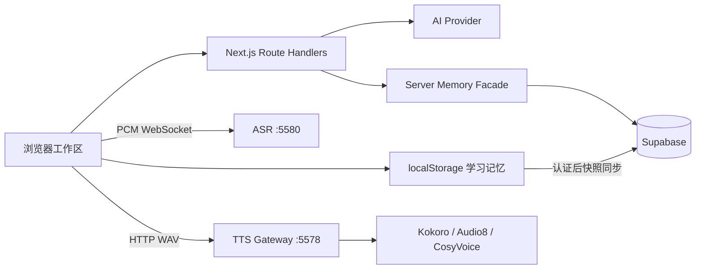

# 开发手册

> 状态：工程运行手册

本文说明如何在本地开发 Moss 的 Next.js 前端、同源业务 API、Supabase 数据层、ASR
WebSocket 服务和 TTS 网关。接口字段以 [`api.md`](api.md) 为准，生产发布和回滚以
[`deployment.md`](deployment.md) 为准。

## 1. 环境要求

| 依赖 | 最低要求 | 用途 |
| --- | --- | --- |
| Node.js | 22 | Next.js、脚本和测试 |
| pnpm | 11 | monorepo 依赖与命令 |
| Python | 3.10 | ASR、TTS 网关及模型运行时 |
| Supabase | 托管项目 | Auth、PostgreSQL、RLS、Realtime、pgvector |
| 浏览器 | 当前稳定版 Chrome 或 Edge | 麦克风、MediaRecorder、Web Audio |

首次初始化：

```bash
pnpm install
cp .env.example .env.local
```

`.env.local` 位于仓库根目录。Next.js 配置会显式读取根目录环境文件；不要另建一份
`frontend/.env.local`，否则开发机和部署环境容易出现不同配置来源。

## 2. 运行模式

| 模式 | 配置 | 命令 | 能力 |
| --- | --- | --- | --- |
| Web 演示 | `NEXT_PUBLIC_DEMO_MODE=true` | `pnpm dev` | 本地演示回复，不依赖 Supabase 或 AI |
| Web + 云服务 | Supabase 与 AI 变量 | `pnpm dev` | 登录、云同步、真实模型回复 |
| 完整离线语音 | 已安装 ASR/TTS | `pnpm dev:offline` | Web、ASR、TTS 一起启动 |
| 单独语音服务 | 对应模型已安装 | `pnpm asr:start` / `pnpm tts:start` | 独立调试协议与模型 |
| 生产构建 | 生产环境变量 | `pnpm build && pnpm start` | 优化后的 Next.js 服务 |

本地地址：

| 服务 | 地址 | 所有者 |
| --- | --- | --- |
| Next.js | `http://localhost:5577` | `frontend` |
| TTS Gateway | `http://127.0.0.1:5578` | `backend/services/tts` |
| ASR | `ws://127.0.0.1:5580/v1/asr/stream` | `backend/services/asr` |
| CosyVoice | `http://127.0.0.1:5581` | TTS 私有 sidecar |
| Audio8 | `http://127.0.0.1:5582` | TTS 私有 sidecar |

`pnpm dev:offline` 由 `backend/dev.mjs` 管理子进程。Web、ASR 或必需的 TTS 网关退出时，
父进程会终止其他子进程，避免遗留占用端口的服务。Audio8 和 CosyVoice 是可选服务，
未安装时不影响 Kokoro 网关启动。

## 3. 请求与数据流



关键顺序：

1. 学习行为先更新浏览器 `LearningMemoryProvider`，本地成功不依赖云端。
2. 登录用户随后通过 Supabase 同步快照；冲突按对象 ID、时间、累计最大值和集合并集解决。
3. 对话请求进入 `frontend/src/app/api`，路由负责校验、认证、限流和错误归一化。
4. Prompt、记忆召回和持久化规则位于 `frontend/src/lib`，不写在路由处理器里。
5. 浏览器直接连接 ASR；TTS 只访问统一网关，不直接调用模型 sidecar。
6. 原始麦克风音频和临时跟读录音只存在于当前浏览器会话，不写入数据库。

## 4. 前端开发

### 4.1 目录职责

| 路径 | 职责 |
| --- | --- |
| `frontend/src/app` | App Router 页面、布局、Metadata 和 Route Handlers |
| `frontend/src/features` | 对话、跟读、复习、设置等完整工作流 |
| `frontend/src/components` | 跨功能共享组件和工作区框架 |
| `frontend/src/components/ui` | shadcn/Base UI 原语 |
| `frontend/src/lib` | 无 React 的领域数据、状态转换和浏览器适配 |
| `frontend/src/lib/server` | 仅服务端可使用的仓储、限流和账户基础设施 |
| `frontend/tests` | Vitest 与 Testing Library 行为测试 |

默认使用 Server Component。只有使用状态、事件、Effect 或浏览器 API 的文件才添加
`"use client"`。不要从 `components/ui` 反向导入 feature，也不要让领域模块依赖 React。

### 4.2 场景与地道表达

场景基础元数据位于 `frontend/src/lib/demo-data.ts`，运行时角色、目标、开场和表达提示位于
`frontend/src/lib/conversation-scenes.ts`。新增场景时：

1. 在 `sceneItems` 中加入唯一、稳定、全小写短横线 ID。
2. 为特殊场景在 `conversationSceneDetails` 中提供专用角色和三条核心表达。
3. 需要解释词义来源时，把结构化数据放入独立领域文件，并通过 `expressionNotes` 接入。
4. 在 `frontend/src/lib/shadowing-dialogues.ts` 增加专用脚本；否则系统会生成六句基础脚本。
5. 同步更新场景、搜索、跟读测试和场景总数断言。

`IdiomaticExpressionNote` 的字段语义：

| 字段 | 要求 |
| --- | --- |
| `phrase` | 实际可说的固定搭配，保留必要冠词或复数 |
| `meaning` | 简洁中文语用含义 |
| `why` | 解释字面图像如何发展为当前含义 |
| `origin` | 给出可审慎表述的语源或使用领域；有争议时必须注明 |
| `example` | 可直接用于当前场景的完整英文句子 |
| `context` | `日常`、`职场` 或 `通用` |

`frontend/src/lib/expression-library.ts` 将 100 条审校表达与
`expression-library.generated.json` 的 900 条场景表达合并为独立词库。词库按
`SceneCategory` 的 10 个分类组织；生成数据必须通过 1000 条、短语唯一、字段完整和完整
例句断言。`frontend/scripts/generate-expression-library.mjs` 仅用于维护内置数据，运行时
页面不会调用模型。不要把未经确认的民间词源写成确定事实。

维护者可在已配置服务端 `AI_*` 变量时运行 `pnpm expressions:generate`。脚本分批生成、
缓存已完成批次，并在写入正式 JSON 前校验条数和全局唯一性；该命令会产生模型调用成本，
生成后必须人工抽查并运行表达词库测试。可用临时变量 `AI_EXPRESSION_FALLBACK_MODEL`
为格式异常的批次指定备用模型。

表达库支持直接粘贴 JSON，以及上传 UTF-8 JSON/CSV 文件。界面提供 JSON 格式说明、可下载
CSV 模板和导入预检；字段为 `phrase`、`meaning`、`why`、`origin`、`example`、
`sceneCategory`，可选 `context` 和 `kind`。两种入口统一调用
`parseExpressionImportRows` 校验和去重。浏览器先写
`moss:expression-library:v1:<userId>`，再按 200 条一批调用 `/api/expressions`；批次大小是
单请求资源边界，不是导入总量上限。用户导入项可在列表中编辑或删除，修改使用稳定
`clientId` 调用 `PUT /api/expressions`，删除调用 `DELETE /api/expressions`；两者都先更新
本机。JSON 输入使用动态加载的 `@monaco-editor/react`，避免增加表达列表首屏包体；新增字段
时同步更新解析器、编辑器、API 校验、数据库约束和文件模板。

### 4.3 影子跟读

`ShadowingDialogue.scriptKind` 区分三类脚本：

- `preset`：人工编写的场景预设，适合重点场景和固定搭配。
- `generated`：根据场景目标、标签和词汇生成的基础六句脚本。
- `memory`：从用户的具体学习记忆临时生成，始终排在队列首位。

脚本必须同时包含 `learner` 和 `partner`，每句提供英文、中文翻译和稳定 ID。角色互换只改变
当前练习侧，不重写脚本；点击任意台词会把说话人设为当前角色。中栏使用
`min-h-0 + flex-1 + overflow-y-auto`，标题、阶段切换、录音操作和场景导航不能跟随长脚本
滚走。

### 4.4 样式与响应式

- 只使用 `frontend/src/app/globals.css` 中的语义 token。
- 新控件优先组合现有 shadcn 组件，图标使用 Lucide。
- 工作区从 `lg` 开始使用多栏，390px 必须回落为无横向溢出的单栏。
- 固定工具栏、波形和计数器使用稳定尺寸，动态内容只能在指定滚动容器内增长。
- 场景图片必须放在 `frontend/public/scenes`，不使用运行时外链。

## 5. Next.js 业务后端

虽然目录名为 `frontend`，`frontend/src/app/api` 中的 Route Handlers 是产品业务后端：

| 路由 | 职责 |
| --- | --- |
| `/api/conversation` | 校验对话、鉴权、限流、记忆召回、模型调用和反馈归一化 |
| `/api/translation` | 翻译辅助；与主英文回复分离 |
| `/api/conversations` | 会话历史分页读取、写入和删除 |
| `/api/memory-documents` | 长期记忆文档同步 |
| `/api/account` | 用户数据导出和删除 |

Route Handler 只处理传输层职责。新增字段时必须同步更新运行时校验、领域类型、测试和
[`api.md`](api.md)。服务器日志不得记录模型密钥、原始麦克风音频或完整私密对话。

浏览器模型配置只保存在版本化的 `moss:model-config:v1`。请求时仅把当前配置加密成短期信封；
禁止将其加入学习记忆、Supabase 快照、分析事件或普通日志。

## 6. Supabase 开发

`backend/supabase/platform.sql` 是新实例完整定义，`backend/supabase/update.sql` 是现有实例
升级入口。结构变更流程：

1. 先更新完整定义，保证新项目可一次建库。
2. 再更新增量 SQL，保证现有项目可升级。
3. 为表、函数、索引、权限和 RLS 增加静态契约测试。
4. 运行 `pnpm db:test`。
5. 在隔离项目先验证增量，再运行 `pnpm db:test:remote`。
6. 使用两个专用账户运行 `pnpm db:test:rls`，确认所有者和跨用户隔离。

不要在已有数据库重放 `platform.sql`。管理脚本所需的 service role key 只能存在于受控服务端
环境或管理员终端。

## 7. ASR 开发

安装与启动：

```bash
pnpm asr:setup
pnpm asr:start
curl http://127.0.0.1:5580/health
```

默认安装 SenseVoiceSmall。需要 Qwen3-ASR 时运行：

```bash
pnpm asr:setup:qwen
```

开发协议时重点验证：

- 客户端先发送 `start` JSON，再发送 16 kHz 单声道 PCM。
- `flush` 提交当前语音段但保持连接；`stop` 提交后关闭。
- 服务只返回中英文最终结果，未知控制消息和超限音频必须明确拒绝。
- 修改 VAD 参数后同时验证弱音、慢速讲话、背景噪声和句尾延迟。
- 单元测试不得下载或加载完整模型。

完整协议和参数见 [`../backend/services/asr/README.md`](../backend/services/asr/README.md)。

## 8. TTS 开发

最小 Kokoro 环境：

```bash
pnpm tts:setup
pnpm tts:gateway
curl http://127.0.0.1:5578/health
```

可选引擎：

```bash
pnpm audio8:setup
pnpm cosyvoice:setup
pnpm tts:start
```

网关拥有浏览器协议、缓存、并发合并和失败归一化；sidecar 只负责模型推理。新增引擎时必须：

1. 在 `engines` 下实现统一适配器。
2. 通过网关公开 voice 和 synthesize 能力。
3. 保持 sidecar 仅监听 loopback 或私有网络。
4. 为网关不可达、模型缺失、超时和参数错误提供不同失败语义。
5. 增加不加载大模型的单元测试。

完整说明见 [`../backend/services/tts/README.md`](../backend/services/tts/README.md)。

## 9. 环境变量与秘密

`.env.example` 是变量名称和默认路径的唯一清单。提交前检查：

- 只有浏览器确实需要的值使用 `NEXT_PUBLIC_*`。
- `AI_API_KEY`、`SUPABASE_SERVICE_ROLE_KEY`、删除审计密钥和模型私钥永不公开。
- `NEXT_PUBLIC_TTS_SERVICE_URL` 只接受 loopback。
- `NEXT_PUBLIC_ASR_API_URL`、`NEXT_PUBLIC_TTS_API_URL` 只能提供公开地址与模型名；语音接口
  密钥只保存在浏览器 `moss:speech-config:v1`，随请求进入同源 `/api/speech/*`。
- 公网 ASR 必须使用 WSS、精确 Origin 白名单和 `MOSS_ASR_API_KEY`。
- 生产环境必须显式关闭 demo 模式并配置稳定的模型信封私钥。

### 不启动本机语音服务

只想验证对话、记忆或设置界面时，不必先运行 `pnpm asr:start`、`pnpm tts:setup`。语音能力有三种
接入方式，在“偏好设置 → 语音服务接入”中按 ASR 与 TTS 分别选择，配置保存在
`moss:speech-config:v1`：

| 接入方式 | 依赖 | 适用场景 |
| --- | --- | --- |
| 本机服务 | `pnpm asr:start` / `pnpm tts:gateway` | 本地离线开发与音质调优 |
| HTTP API | 任意 OpenAI 兼容 `/audio/transcriptions`、`/audio/speech` | 云端语音、团队共享网关 |
| 浏览器引擎 | 浏览器 `SpeechRecognition` / `speechSynthesis` | 零服务冒烟、演示环境 |

`local` 接入失败不会中断练习：ASR 会在当次会话内回退到浏览器引擎并提示一次，TTS 回退到系统
语音。排查本机服务时先运行 `pnpm asr:test` 与 `pnpm tts:test`，再用设置中的“测试合成接口”
确认 `/api/speech/tts` 是否能取回音频。

## 10. 测试与质量门

日常开发按影响范围运行：

```bash
pnpm --dir frontend test
pnpm typecheck
pnpm lint
```

提交前运行完整质量门：

```bash
pnpm check
pnpm build
```

附加验证：

| 改动 | 追加检查 |
| --- | --- |
| 数据库 SQL | `pnpm db:test`，隔离项目运行远端与 RLS 检查 |
| ASR | `pnpm asr:test`，目标设备真实语音验收 |
| TTS | `pnpm tts:test`，目标设备试听 |
| 视觉布局 | 桌面和 390px 截图、横向溢出检查 |
| 生产依赖 | `pnpm test:coverage` 与 `pnpm build` |

测试失败时修复实现或正确的期望值，不删除行为断言，也不降低测试门槛。

## 11. 常见问题

### Web 启动但读取不到根目录环境变量

确认从仓库根目录运行 `pnpm dev`，并检查 `.env.local` 位于根目录。修改公开变量后重启
Next.js，因为这些变量会在构建阶段内联。

### 端口被占用

先确认是否有另一组 `pnpm dev:offline` 子进程仍在运行。开发服务器固定使用 5577；语音服务
端口变化时必须同步修改根环境变量和允许的 Origin。

### TTS 自动回退浏览器语音

先请求 `GET http://127.0.0.1:5578/health`。网关完全不可达时允许回退；网关可达但模型文件
缺失时应修复安装，不应把配置错误当成降级成功。

### ASR 能连接但没有 final

检查浏览器采样、`start` 消息、Origin、API key 和 VAD 阈值。先用安静环境和默认
SenseVoice 验证协议，再调整噪声倍率、预录窗口和句尾静音。

### 云端记忆不同步

依次检查登录态、浏览器网络请求、Supabase Realtime publication、RLS 和
`sync_learning_memory` RPC。不要通过关闭 RLS 排查生产问题。

## 12. 完成标准

一个功能只有在以下条件全部满足后才完成：

1. 正常、加载、空、禁用、错误和完成状态一致。
2. 本地优先与云同步的失败路径仍可工作。
3. 相关领域、接口、部署或界面文档已更新。
4. `pnpm check` 和需要时的 `pnpm build` 通过。
5. 视觉改动经过桌面与 390px 浏览器验证。
6. 任务从 `plans/in-progress.md` 移至 `plans/archived.md`；外部依赖问题进入
   `plans/blocked.md`。
