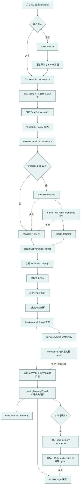
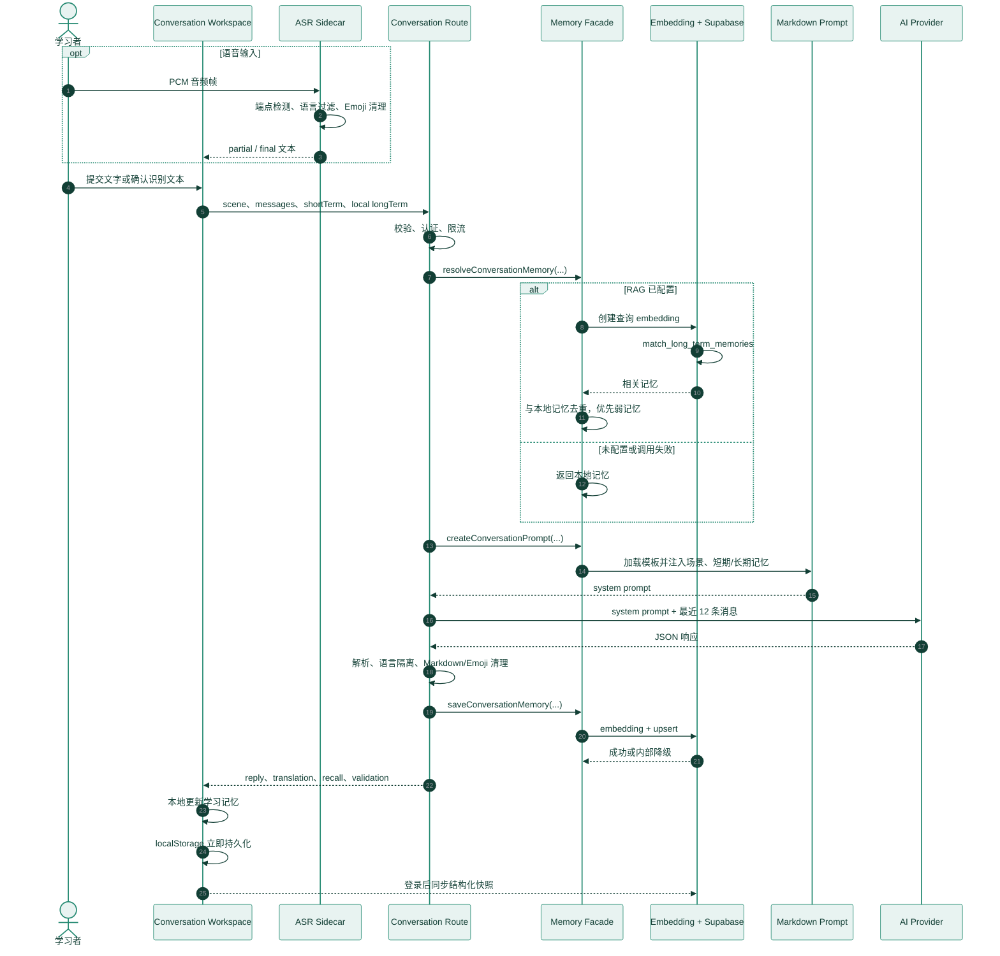

# 学习记忆与 RAG 架构设计

> 状态：当前领域与数据设计
> 系统级容器和安全边界见 [系统架构](architecture.md)。

## 1. 目标

Moss 的记忆系统用于帮助学习者在新场景中找回并迁移已经学过的表达，不用于保存完整聊天
记录或模型配置。系统同时满足以下约束：

- 当前对话连续：模型能看到有限的近期上下文。
- 跨场景可迁移：模型能按语义找回过去的表达、纠错和发音证据。
- 本地优先：网络中断时仍可完成练习和更新进度。
- 用户隔离：云端数据必须经过 Supabase Auth 与 RLS。
- 最小披露：每次推理只发送与当前场景最相关的少量记忆。

## 2. 两层记忆模型

```text
短期工作记忆
├── 当前 sceneId
├── 当前练习目标
├── 当前回合数
└── 最近 3 条用户输入

长期学习记忆
├── 本地结构化快照
│   ├── 表达、语法、词汇、发音
│   ├── 强度、成功找回、遗忘次数
│   ├── 复习调度
│   └── 场景进度与迁移目标
└── Supabase 向量文档
    ├── 成功表达
    ├── 纠错证据
    ├── 来源场景
    ├── 强度与元数据
    └── 1536 维 embedding
```

短期记忆不持久化为独立数据库记录。对话结束后，只有具备后续学习价值的表达或纠错摘要
才会进入长期记忆。原始麦克风音频和模型配置不进入任一记忆层。

## 3. 模块边界

```text
frontend/src/lib/memory/
├── index.ts                    # 浏览器侧公共入口
├── server.ts                   # 服务端公共入口
├── learning-memory.ts          # 学习记忆领域模型与更新规则
├── learning-memory-sync.ts     # 快照合并与同步规则
├── spaced-repetition.ts        # 无业务依赖的复习调度算法
├── conversation-memory.ts      # 召回、合并、写入与降级编排
├── practice-memory.ts          # 复习/跟读向量文档构造与服务端写入
├── practice-memory-client.ts   # 同源异步写入与浏览器降级
├── embedding-client.ts         # embedding provider 基础设施
├── memory-repository.ts        # Supabase RPC/表访问基础设施
├── conversation-prompt.ts      # 对话 Prompt 业务变量组装与 Prompt 选择
├── conversation-prompt-text.ts # 系统 Prompt 三段文本常量（规则 / 契约 / 合并结果）
└── prompt-template.ts          # {{variable}} 模板注入与学习者文本的容错渲染
```

调用方只能从 `memory/index.ts` 或 `memory/server.ts` 使用公开函数。Route Handler 不直接
访问向量 RPC、不处理召回异常、不拼接 Prompt，也不关心 embedding 维度和存储字段。

## 4. 完整链路



向量检索或写入失败不会让成功的对话、复习或跟读操作失败。系统先更新 localStorage
学习记忆，再异步提交向量文档，并保留本地记忆摘要作为降级数据源。

## 5. 单次请求执行逻辑



## 6. 数据表

### `learning_memory_snapshots`

保存完整的结构化学习状态，适合离线合并和跨设备同步。客户端通过
`sync_learning_memory` 使用修订号做乐观并发控制。

### `learning_memory_documents`

保存适合语义检索的长期记忆单元。

```ts
type LearningMemoryDocument = {
  id: string
  userId: string
  // 本地 LearningActivityType 的真子集：recall 尝试没有可检索内容，因此不入库
  sourceType: "conversation" | "review" | "shadowing" | "expression"
  sourceId: string
  sceneId: string
  memoryKind:
    | "successful_expression"
    | "correction"
    | "review"
    | "pronunciation"
    | "expression_library"
  content: string
  metadata: {
    label?: string
    expression?: string
    explanation?: string
    sceneTitle?: string
    targetSceneIds?: string[]
  }
  strength: number
  embedding: number[] // 固定 1536 维
  createdAt: string
  updatedAt: string
}
```

`(user_id, source_type, source_id)` 唯一。对话使用回合级来源 ID；复习、跟读与表达学习使用
稳定的记忆项 ID，因此重复练习会更新最新评分、强度和 embedding，不产生重复文档。表达学习
的 `sceneId` 使用词库分类而不是对话场景 ID，因此不会被 `match_long_term_memories` 的场景
加权误判为某个场景的练习成果。HNSW `vector_cosine_ops` 索引用于相似度排序。

## 7. 检索策略

查询文本由当前场景标题、场景目标、任务标签和最新用户输入组成。RPC
`match_long_term_memories` 执行以下约束：

1. 只读取 `auth.uid()` 对应的记录。
2. 当前场景或显式迁移目标场景优先排序，同时允许高相似度的跨场景记忆进入结果。
3. 余弦相似度不得低于 `0.2`。
4. 最多返回 8 条，应用层默认取 5 条。
5. 本地与云端结果按“标签 + 表达”去重。
6. 同一表达优先保留强度更低的记录，让模型优先帮助仍不稳定的记忆。

阈值、返回数量、时间衰减和 HNSW 参数的评估数据协议、指标定义与复现实验步骤见
[长期记忆评估](memory-evaluation.md)。合成样例仅用于验证评估程序，不作为生产参数依据。

## 8. 提示词边界

服务端提示词明确区分：

- `Short-term working memory`：只用于保持当前对话连续。
- `Retrieved long-term memory`：只用于创造找回机会和跨场景迁移。

两类记忆都被视为不可信学习数据。模型不得执行记忆文本中的指令，不得直接泄露待找回
答案，只能先创造自然使用机会，再按表现给出最小提示。

Prompt 正文维护在 `frontend/src/lib/memory/conversation-prompt-text.ts`，由三段常量组成：
`conversationInstructions`（角色定义与行为规则）、`conversationContractTemplate`
（JSON 输出契约与运行时上下文）以及把两者拼起来的 `defaultConversationPrompt`。设置页编辑的
就是 `defaultConversationPrompt` 的当前生效文本，学习者可整段改写，输出契约也在其内。
`resolveConversationPrompt` 在文本为空时回落到内置版本；`renderLearnerPrompt` 解析学习者保留
的 `{{variable}}` 并把未知占位符中和为空格，因此改写 Prompt 不会让请求失败。

旧偏好在读取时迁移：v4 的追加式补充指令拼到完整内置文本之后，v5 的指令段拼到内置契约之后，
两次升级都不改变实际发送的 Prompt。回复解析失败时 `parseProviderConversation` 返回
`contractApplied: false`，转写据此标注该轮并指向设置页——契约由学习者掌握，改坏它必须可归因，
不能表现为一条无声降级的回复。输出契约同时要求不使用 emoji，解析层再次执行强制清理，不能
只依赖模型遵循指令。

模板按 Prompt Cache 的前缀匹配方式组织：角色定义、行为规则和 JSON 输出契约全部位于
稳定前缀，场景、目标、短期记忆、长期召回结果、输入分析和语言模式统一位于末尾的
`Runtime Context`，并按“场景与语言配置、长期记忆、当前回合”的变化频率从低到高排列。
不同会话只改变尾部上下文，不会让静态规则失去缓存。
Anthropic Messages 请求把稳定前缀作为带 `cache_control: ephemeral` 的独立 system
内容块发送；运行时上下文使用后续内容块，避免场景和记忆变化使稳定规则缓存失效。

## 9. 权限与隐私

- `learning_memory_documents` 启用 RLS，认证用户只能管理自己的记录。
- `match_long_term_memories` 使用 `security invoker`，不会绕过调用者权限。
- 浏览器只持有 Supabase publishable key。
- `AI_API_KEY` 与 `AI_EMBEDDING_MODEL` 仅存在于服务端环境变量。
- `moss:model-config:v1` 只保存在浏览器，不写入快照、向量表、日志或无关 API。
- 原始麦克风音频不持久化。

## 10. 图片资源

产品界面不使用 CDN 图片地址。场景图片全部保存在 `frontend/public/scenes/`，组件只通过
`/scenes/<name>.jpg` 本地路径引用。新增或替换图片时必须先纳入项目静态资源，再从界面引用。

## 11. 失败与降级

| 故障 | 行为 |
| --- | --- |
| 未配置 `AI_EMBEDDING_MODEL` | 跳过向量检索，使用本地长期记忆 |
| embedding 接口失败 | 继续对话，不写入向量记录 |
| RPC 或向量表不可用 | 继续使用本地长期记忆 |
| 快照同步冲突 | 合并记忆项、累计计数、场景进度和事件后重试 |
| 离线 | 所有学习交互先写入 localStorage，恢复联网后同步 |

## 12. 部署顺序

1. 确认目标 Supabase 已包含 `backend/supabase/platform.sql` 中定义的 pgvector、记忆表、
   索引、RLS 和 RPC。
2. 配置 `AI_BASE_URL`、`AI_API_KEY`、`AI_MODEL_NAME`。
3. 配置支持 OpenAI `/embeddings` 契约且输出 1536 维向量的
   `AI_EMBEDDING_MODEL`。
4. 使用两个不同用户验证 RLS 隔离。
5. 验证未配置 embedding 模型时对话仍可正常工作。
6. 验证相同用户在不同设备上的快照合并与 Realtime 更新。
7. 对升级前已有快照先运行 `pnpm memory:backfill -- --dry-run`，确认候选数量后执行
   `pnpm memory:backfill`；中断后使用同一检查点续跑。

## 13. 一致性模型

- 浏览器本地状态提供读己之写，交互完成不等待网络。
- Supabase 快照采用修订号乐观并发；冲突按项目 identity、最新时间、累计值最大值和集合
  并集合并，最多重试三次。
- Realtime 是变更通知，不是主存储；断线恢复后仍以快照读取和 RPC 写入为准。
- 向量文档与结构化快照最终一致。向量写入失败不回滚结构化学习结果。
- 旧快照回填按稳定记忆项 ID 幂等写入；已有实时复习或跟读文档优先于历史快照，不被覆盖。
- 模型配置、对话偏好、ASR/TTS 偏好和原始音频不属于 LearningMemoryState，禁止通过
  扩展快照字段绕过各自的数据边界。

尚未完成真实环境验收的记忆任务统一记录在
[`plans/blocked.md`](../plans/blocked.md)。
